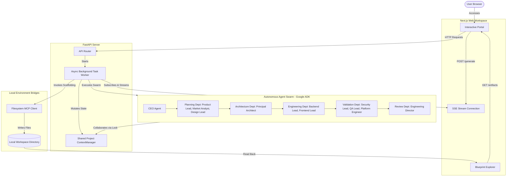

# ⚡ DevForge AI

<p align="center">
  
  
  
  
  
  
</p>

An autonomous, multi-agent software engineering SWARM that transforms raw product ideas into production-ready engineering blueprints and project scaffold packages via cooperative department collaboration.

---

## 📖 Table of Contents
- [What is DevForge AI?](#what-is-devforge-ai)
- [Motivation](#motivation)
- [Key Features](#key-features)
- [Architecture Overview](#architecture-overview)
- [Folder Structure](#folder-structure)
- [Technology Stack](#technology-stack)
- [Installation & Setup](#installation--setup)
- [Environment Variables](#environment-variables)
- [Running Locally](#running-locally)
- [Development Workflow](#development-workflow)
- [Build Instructions](#build-instructions)
- [Deployment](#deployment)
- [API Overview](#api-overview)
- [Agent Swarm Architecture](#agent-swarm-architecture)
- [Roadmap](#roadmap)
- [Known Limitations & Trade-offs](#known-limitations--trade-offs)
- [Future Improvements](#future-improvements)
- [License](#license)
- [Contributing](#contributing)

---

## What is DevForge AI?

DevForge AI is an autonomous software development swarm operating as a virtual software company. Given a user idea, a swarm of **11 specialized AI agents** structured into Planning, Architecture, Engineering, Validation, and Review departments collaborate under the supervision of a CEO agent. The final output is a complete, production-ready blueprint including wireframe layouts, OpenAPI specifications, database DDLs, containerization configs, and threat models.

---

## Motivation

Traditional single-prompt generators suffer from:
1. **Context Drift:** Models lose track of large context scopes and overwrite previous functional features.
2. **Lack of Peer Review:** Code is generated without a verification mechanism, leading to architectural bugs.
3. **Sandbox Traversal Risk:** Executing filesystem operations without boundaries bypasses local security safeguards.

**DevForge AI** solves these issues with:
- **11 Role-Isolated Agents** communicating via structured interfaces.
- **Shared Project Context Manager** using an async lock enforcing the *Single Writer Principle*.
- **Google Agent Development Kit (ADK)** to enforce structured Pydantic schema validation.
- **Model Context Protocol (MCP) filesystem server** running inside a sandboxed target folder.

---

## Key Features

- **Sequential & Parallel Phases:** Parallel departments (Planning, Engineering, Validation) run concurrently to reduce pipeline latency.
- **Revision Loops & Quality Gates:** The Engineering Director evaluates the swarm output against the PRD. Critical failures trigger a scoped revision cycle (capped at 2 attempts to prevent loops).
- **Glassmorphic Swarm Dashboard:** Next.js 15 UI displaying real-time SSE execution logs, timeline logs, and an integrated blueprint file explorer.
- **Zip Blueprints Exporter:** Downloads the generated folder structure with a single click.

---

## Architecture Overview



---

## Folder Structure

```
DevForge-AI/
├── apps/
│   ├── backend/                # FastAPI + Google ADK backend app
│   │   ├── agents/             # Role-isolated agent classes
│   │   ├── api/                # FastAPI routers & routes (SSE, projects)
│   │   ├── context/            # Shared Project Context Manager and Schemas
│   │   ├── generator/          # Scaffolder invoking Filesystem MCP
│   │   ├── mcp/                # Filesystem and GitHub MCP clients
│   │   ├── prompts/            # Raw prompt files loaded via PromptLoader
│   │   └── main.py             # Backend FastAPI entrypoint
│   └── frontend/               # Next.js frontend workspace portal
│       └── src/app/page.tsx    # Workspace and explorer views
├── packages/
│   ├── shared-schemas/         # Shared Pydantic data schemas
│   └── mcp-client/             # Placeholder packaging library
├── docs/                       # Project setup guides & architectures
├── tests/
│   └── backend-unit/           # Pytest suites covering agents & routes
├── AUDIT.md                    # Technical code audit report
├── CHANGELOG.md                # Project changelog
└── LICENSE                     # MIT license
```

---

## Technology Stack

- **Frontend Framework:** Next.js 15 (React 19) + TypeScript + Tailwind CSS (v4)
- **Backend Framework:** FastAPI (Python 3.11+) + Pydantic v2 + structlog
- **Agent Orchestration:** Google Agent Development Kit (ADK) v2.3.0
- **Supported Models:** Gemini 2.5 Flash / Gemini 2.0 Flash
- **Local Sandbox Protocol:** Model Context Protocol (MCP) stdio Filesystem
- **Package Managers:** uv (Python) / npm (Node.js)

---

## Installation & Setup

### Prerequisites
- Python 3.11+
- Node.js 20+
- [uv](https://docs.astral.sh/uv/) python manager
- Google Gemini API key from [Google AI Studio](https://aistudio.google.com/app/apikey)

### 1. Root Configuration
Clone the repository and copy the example environment file:
```bash
cp .env.example .env
```
Open `.env` and fill in your details:
```env
GEMINI_API_KEY="your-google-ai-studio-api-key"
```

### 2. Backend Setup
Navigate to the backend app, synchronize Python virtual environments, and install the shared-schemas package:
```bash
cd apps/backend
uv sync
```

### 3. Frontend Setup
Navigate to the frontend app and install dependencies:
```bash
cd apps/frontend
npm install
```

---

## Environment Variables

| Variable | Description | Default |
| :--- | :--- | :--- |
| `GEMINI_API_KEY` | Your Google AI Studio API key | `""` |
| `MOCK_LLM` | Set to `true` to run offline using structured mock responses | `false` |
| `LOG_LEVEL` | Application logging level (`DEBUG`, `INFO`, `WARNING`, `ERROR`) | `INFO` |
| `OUTPUT_DIR` | Absolute or relative folder path where blueprints are written | `./workspace` |
| `MAX_REVISION_ATTEMPTS` | Maximum number of review iteration loops before pipeline failure | `2` |
| `AGENT_TIMEOUT_SECONDS` | Timeout limit for a single agent API execution call | `120` |
| `AGENT_MAX_RETRIES` | Retries count before marking agent execution as failed | `3` |

---

## Running Locally

### 1. Start FastAPI Server
From the `apps/backend/` directory:
```bash
uv run uvicorn main:app --reload --port 8000
```
FastAPI runs on `http://127.0.0.1:8000`. Endpoint swagger documentation can be viewed at `http://127.0.0.1:8000/docs`.

### 2. Start Next.js Development Server
From the `apps/frontend/` directory:
```bash
npm run dev
```
Open `http://localhost:3000` to access the workspace.

---

## Development Workflow

### Swarm Execution Cycle
1. **CEO Agent Bootstrap:** Refines the raw project concept, defines stack suggestions, and updates metadata.
2. **Planning Phase (Parallel):** `Product Lead`, `Market Analyst`, and `Design Lead` generate the PRD, competitor SWOTS, and UX blueprints concurrently.
3. **Architecture Phase (Sequential):** `Principal Architect` designs the core topology and Mermaid system flows.
4. **Engineering Phase (Parallel):** `Backend Lead` and `Frontend Lead` build OpenAPI schemas, DDLs, and routers.
5. **Validation Phase (Parallel):** `Security Lead`, `QA Lead`, and `Platform Engineer` build threat reports, test checklists, and docker-composes.
6. **Review Phase (Sequential):** `Engineering Director` evaluates all slices. Returns `approved=True` to complete, or triggers revisions if criteria are not met.

---

## Build Instructions

### Backend Package Compilation
Build local wheel distribution packages for packages like shared-schemas:
```bash
cd packages/shared-schemas
python -m pip install --upgrade build
python -m build
```

### Frontend Production Build
To build the Next.js portal application for production deployment:
```bash
cd apps/frontend
npm run build
```

---

## Deployment

Deploying the backend uvicorn service is standard:
```bash
uvicorn main:app --host 0.0.0.0 --port 8000 --workers 4
```

> [!WARNING]
> Scaling uvicorn horizontally to multiple workers breaks the current in-memory status dictionary. For multi-node or multi-process deployments, you must configure a persistent database and Redis session queue.

---

## API Overview

- `POST /api/projects/generate` — Submits a user idea request and runs the background Swarm pipeline.
- `GET /api/projects/{project_id}/status` — Checks progress percentage and active agent status.
- `GET /api/projects/{project_id}/stream` — Server-Sent Events (SSE) progress log stream.
- `GET /api/projects/{project_id}/artifacts` — Lists generated file schemas and code contents.
- `GET /api/projects/{project_id}/download` — Compiles and downloads workspace files as a ZIP bundle.
- `GET /api/projects/health` — API health check endpoint.

---

## Agent Swarm Architecture

| Department | Agent Name | Role | Inputs | Outputs |
| :--- | :--- | :--- | :--- | :--- |
| — | **CEO Agent** | SWARM Initiator | User Concept | Refined metadata, stacks |
| **Planning** | **Product Lead** | Functional PRD Designer | Metadata | `prd_markdown` |
| **Planning** | **Market Analyst** | Competitor SWOTS auditor | Metadata | `competitor_brief_markdown` |
| **Planning** | **Design Lead** | UX Wireframe strategist | Metadata | `ux_layout_specs` |
| **Architecture** | **Principal Architect**| Topologist | Planning output | `topology_markdown`, `design_rationale` |
| **Engineering** | **Backend Lead** | Database DDL and API spec compiler | Architecture | `api_spec_yaml`, `database_schema_sql` |
| **Engineering** | **Frontend Lead** | Component / UI route mapper | Architecture | `routing`, `frontend_pages`, `components` |
| **Validation** | **Security Lead** | OWASP and threat analyzer | Engineering | `security_report_markdown` |
| **Validation** | **QA Lead** | Unit & integration test planner | Engineering | `test_plan_markdown` |
| **Validation** | **Platform Engineer** | Docker / deployment builder | Engineering | `dockerfile`, `docker_compose_yml` |
| **Review** | **Engineering Director**| Quality checker | Full Context | `approved` (Bool), feedback list |

---

## Roadmap

- **V2.0.0 GitHub Publishing MCP:** Automatically export generated blueprints to a targeted GitHub repo using a GitHub MCP server connection.
- **Persistent DB Contexts:** Migrate active contexts from in-memory dicts to a local SQLite/PostgreSQL engine.
- **Mock Sandbox Runner:** Spawn a local Docker container compiling backend specs to check for runtime syntax failures.

---

## Known Limitations & Trade-offs

- **Non-Reentrant Locks:** `ContextManager` uses `asyncio.Lock`. If an agent tries to log an action during a locked mutation block, execution deadlocks. Agents must log action milestones strictly outside of write blocks.
- **In-Memory Registry:** The server cannot scale horizontally without replacing the dictionary registry with shared databases.

---

## Future Improvements

- Replace the standard asyncio Lock with a re-entrant lock scheme.
- Add comprehensive Vitest test cases for frontend Next.js modules.
- Centralize context logging using centralized lock manager services (e.g. Redis).

---

## License

This project is licensed under the MIT License — see the [LICENSE](LICENSE) file for details.

---

## Contributing

We welcome community pull requests.
1. Fork the repo and create your branch: `git checkout -b feature/my-feature`.
2. Format your Python files using black/ruff and Next.js styles.
3. Keep commit histories modular and logical.
4. Ensure all unit tests (`uv run pytest`) pass successfully before submitting PRs.
