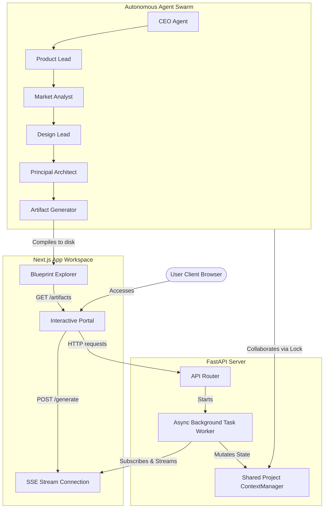

<div align="center">
  <h1>⚡ DevForge AI</h1>
  <p><strong>An autonomous AI software company that transforms ideas into production-ready engineering blueprints.</strong></p>
  <p>
    
    
    
    
    
  </p>
</div>

---

## What is DevForge AI?

DevForge AI is an autonomous multi-agent platform that acts as a virtual software company. Submit a product idea, and watch a team of 11 specialized AI agents—organized into Planning, Architecture, Engineering, Validation, and Review departments—collaborate to produce a complete, production-ready engineering blueprint and starter project.

**This is not a chatbot.** It is an AI organization.

---

## How It Works

1. **Submit your idea** — Describe your software concept and preferred stack.
2. **Watch the Forge** — Agents collaborate live in the browser: debate architecture, write database schemas, audit security, plan tests.
3. **Download your blueprint** — Receive a structured starter project with docs, API specs, schemas, Dockerfiles, and CI/CD pipelines.

---

## Agent Team

| Department | Role | Responsibility |
|---|---|---|
| — | CEO | Orchestrates workflow |
| Planning | Product Lead | PRD & user stories |
| Planning | Market Analyst | Competitor analysis |
| Planning | Design Lead | UX flows & layouts |
| Architecture | Principal Architect | System topology |
| Engineering | Backend Lead | API specs & DB schemas |
| Engineering | Frontend Lead | UI scaffolding |
| Validation | Security Lead | Threat modeling |
| Validation | QA Lead | Test plans |
| Validation | Platform Engineer | Docker & CI/CD |
| Review | Engineering Director | Final sign-off |

---

## Technology Stack

| Layer | Technology |
|---|---|
| Frontend | Next.js 14 + Tailwind CSS + TypeScript |
| Backend | FastAPI (Python 3.11+) |
| AI Orchestration | Google Agent Development Kit (ADK) |
| LLM | Gemini 1.5 Flash / Pro |
| MCP | Filesystem MCP + GitHub MCP |
| Package Manager | uv |
| Deployment | Vercel (Frontend) + Render/Railway (Backend) |

---

## Quick Start

### Prerequisites
- Python 3.11+
- Node.js 20+
- [uv](https://docs.astral.sh/uv/) package manager
- A Gemini API key from [Google AI Studio](https://aistudio.google.com/app/apikey)

### Backend

```bash
# Clone the repository
git clone https://github.com/SujalUshir/DevForge-AI.git
cd DevForge-AI

# Set up environment
cp .env.example .env
# Edit .env and add your GEMINI_API_KEY

# Install and run backend
cd apps/backend
uv sync
uv run uvicorn main:app --reload --port 8000
```

### Frontend

```bash
cd apps/frontend
npm install
npm run dev
```

Open [http://localhost:3000](http://localhost:3000) in your browser.

---

## Project Structure

```
DevForge-AI/
├── apps/
│   ├── backend/          # FastAPI + Google ADK backend
│   └── frontend/         # Next.js frontend workspace
├── packages/
│   ├── shared-schemas/   # Shared Pydantic/TypeScript schemas
│   └── mcp-client/       # MCP client wrappers
├── docs/                 # PRD, System Architecture, guides
├── tests/
│   ├── backend-unit/     # Backend unit tests
│   └── frontend-unit/    # Frontend component tests
└── scripts/              # Setup and utility scripts
```

---

## Documentation

| Document | Description |
|---|---|
| [PRD](docs/PRD.md) | Product Requirements Document |
| [System Architecture](docs/SYSTEM_ARCHITECTURE.md) | Technical architecture blueprint |

---

## 🏆 Competition Assets & Release Checklist

### System Topology Diagram



### ⏱️ 5-Minute Demo Script

| Time | Segment | Description / Script Action |
|---|---|---|
| **0:00 - 1:00** | **Hero & About** | Introduce DevForge AI as an autonomous multi-agent platform, highlighting the 11 specialized roles working collaboratively across departments. Show the home page. |
| **1:00 - 2:00** | **Instant Launch** | Click "⚡ Try Sample Project". Point out how the input form is pre-filled and submitted automatically, bypassing complex parameters to show immediate results. |
| **2:00 - 3:30** | **Live Event Stream** | Focus on the Live Workspace Dashboard. Explain how the real-time event logs are streamed from FastAPI using Server-Sent Events (SSE) while the progress bar progresses from Planning through Architecture to Review. |
| **3:30 - 4:30** | **Blueprint Explorer** | When generation completes, showcase the Blueprint Explorer. Click through files (`PRD.md`, `architecture.md`, `api_spec.yaml`). Call attention to the beautiful markdown heading rendering and copy buttons. |
| **4:30 - 5:00** | **Download Blueprint** | Click "Download Blueprint". Show that it instantly compresses the entire workspace of files on-disk into a single ZIP file and prompts a native browser download. |

### ✅ Submission Checklist

- [x] **Backend Health:** `/api/health`, `/api/projects/version`, and `/api/projects/about` endpoints return success status code.
- [x] **Testing:** Backend test suite passes all 16/16 unit checks.
- [x] **Frontend Compilation:** TypeScript compiles cleanly. Build command `npm run build` succeeds in Turbopack production mode with no errors.
- [x] **ZIP Compressing:** Temporary file creation checks successfully output zip packages.

---

## License

MIT License — see [LICENSE](LICENSE) for details.
