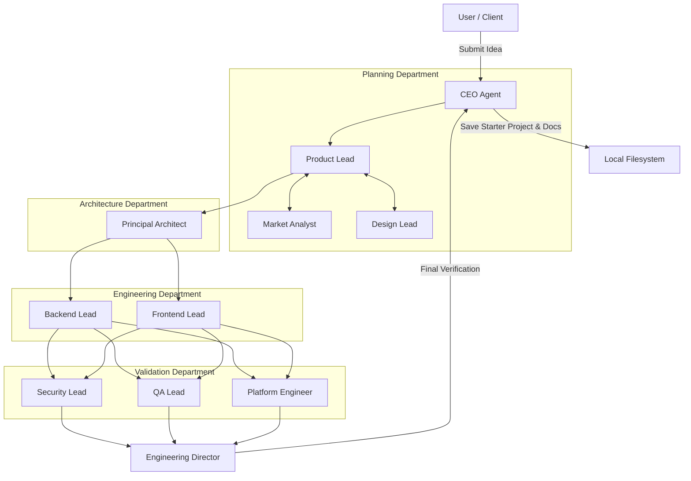
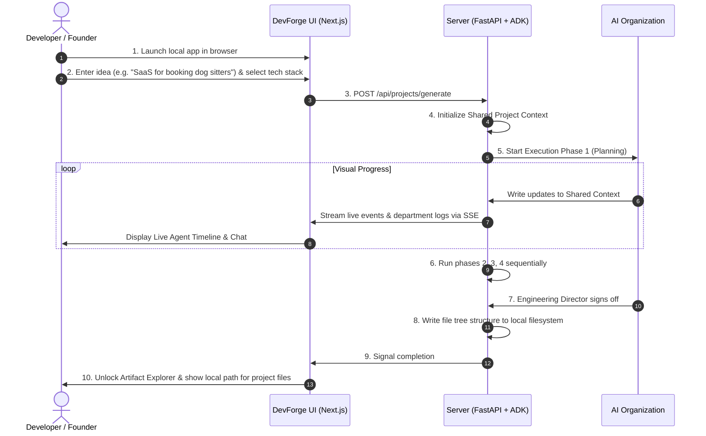

# Product Requirements Document: DevForge AI (Version 1 MVP)
**Version:** 1.1 (Refined for Competition MVP)  
**Author:** Senior Product Manager  
**Date:** July 3, 2026  
**Status:** Approved for Implementation  

---

## Executive Summary

DevForge AI is an autonomous AI software company that transforms software ideas into production-ready engineering blueprints and starter project code through structured collaboration between specialized AI agents. Optimized for a 5-day build as a competition MVP, Version 1 provides an authentication-less, local-filesystem-based virtual software company. Users submit their product concepts and watch a team of virtual specialists—organized into functional departments (Planning, Architecture, Engineering, and Validation)—collaboratively synthesize a complete starter project and design documentation package.



---

## Table of Contents
1. [Background](#1-background)
2. [Problem Statement](#2-problem-statement)
3. [Solution](#3-solution)
4. [Version 1 MVP Definition](#4-version-1-mvp-definition)
5. [Goals & Success Criteria](#5-goals--success-criteria)
6. [Non-Goals (Version 1)](#6-non-goals-version-1)
7. [User Journey](#7-user-journey)
8. [Core Features](#8-core-features)
9. [Shared Project Context](#9-shared-project-context)
10. [Agent & Role Definitions](#10-agent--role-definitions)
11. [System Workflow & Execution Phases](#11-system-workflow--execution-phases)
12. [Functional Requirements](#12-functional-requirements)
13. [Non-Functional Requirements](#13-non-functional-requirements)
14. [Security & Protection](#14-security--protection)
15. [Technology Stack](#15-technology-stack)
16. [File Scaffolding & Generated Artifacts](#16-file-scaffolding--generated-artifacts)
17. [Development Philosophy](#17-development-philosophy)
18. [Competition Alignment](#18-competition-alignment)
19. [Future Roadmap (V2 & V3)](#19-future-roadmap-v2--v3)
20. [Risks & Mitigations](#20-risks--mitigations)
21. [Success Metrics](#21-success-metrics)
22. [Competitive Advantage](#22-competitive-advantage)

---

## 1. Background

Modern software development requires multiple specialists such as Product Managers, Software Architects, Security Engineers, Backend Engineers, Frontend Engineers, QA Engineers, DevOps Engineers, and Reviewers. 

Solo developers, startups, and small teams rarely have access to all these experts. DevForge AI solves this by creating an autonomous organization of AI agents. Instead of interacting with one chatbot, users collaborate with an AI engineering company where each agent has a specialized responsibility and works together with the others. The system produces actionable engineering blueprints and starter code rather than simple conversational responses.

---

## 2. Problem Statement

### What problem exists today?
Building software requires coordinating multiple specialized disciplines. When a single developer or small team attempts to cover all these bases, they encounter a "context-switching tax" and gaps in expertise. Architecture suffers, security is treated as an afterthought, database schemas are sub-optimal, and testing is minimal.

### Why current AI chatbots are insufficient?
Current AI chatbots (such as ChatGPT, Claude, or basic copilots) operate primarily on a single-turn or simple conversational loop. 
1. **Lack of Context & Cohesion:** They do not maintain a unified architectural blueprint across different code blocks.
2. **"Yes-Man" Behavior:** Chatbots tend to agree with the user's initial assumptions, even if those assumptions lead to bad database designs or security flaws.
3. **No Peer Review:** They generate code or configurations without running secondary validation, compiler checks, or security auditing agents.
4. **Scope Creep & Fragmentation:** They lack the capability to output structured, multi-file engineering directories with synchronized data models, API specs, and deployment scripts.

### Why specialized collaborating agents are better?
A multi-agent system models real-world human organizations. By assigning clear, constrained roles (e.g., a Security Lead who *only* critiques code for vulnerabilities, a Principal Architect who *only* enforces system modularity), we create a system of "checks and balances." Agents review each other's work, request revisions, and enforce rigorous quality gates. This results in cohesive, secure, and production-ready blueprints rather than fragmented, copy-pasted code snippets.

### Why this problem matters for modern software development?
With the rise of AI-assisted coding, the bottleneck in software engineering is shifting from *writing lines of code* to *designing, verifying, and orchestrating complex systems*. Providing developers with complete, verified engineering blueprints prevents downstream development failures and significantly speeds up time-to-market.

---

## 3. Solution

**DevForge AI** is an autonomous multi-agent platform that translates high-level software ideas into a complete, verified "engineering package." 

### How it Works
1. **Ingestion:** The user submits a software idea, specifying target audience, core features, and preferred tech stack (optional).
2. **Briefing:** The CEO Agent coordinates the request and tasks the Product Lead to establish the initial project scope.
3. **Collaborative Planning:** The Product Lead, Market Analyst, and Design Lead collaborate to produce a unified technical plan.
4. **Implementation & Refinement:** The Backend Lead and Frontend Lead write the detailed code skeletons, API specs, and schema files based on the architecture.
5. **Auditing & Testing:** The Security Lead, QA Lead, and Platform Engineer review the code, generate test suites, and write infrastructure-as-code files.
6. **Review Gate:** The Engineering Director performs a static review against requirements and hands off the verified package to the CEO.
7. **Delivery:** The user receives a comprehensive ZIP archive containing a fully designed project blueprint alongside a live dashboard detailing the chat transcripts and logic behind every decision.

### Why multiple agents are necessary?
A single LLM cannot effectively roleplay multiple conflicting positions (such as developer vs. QA vs. security auditor) in a single context without losing depth or showing bias. By segregating these roles into distinct agents with specialized prompt limits, system parameters, and specialized tools, we enforce professional critical feedback and produce vastly higher quality system designs.

### What makes it different from ChatGPT, Claude, Cursor, and Copilot?
* **Autonomous Workflows:** Instead of step-by-step user prompting, the user acts as the Client/Approver. The agents do the heavy lifting of collaborating, critiquing, and revising.
* **Blueprint Focus:** Instead of just outputting code snippets, it creates the entire scaffolding (database tables, API routes, security policy docs, test specs, and infrastructure setups) as a unified, compilable project blueprint.
* **Strict Quality Gates:** An agent's output is not final until the QA and Security leads approve it and the Engineering Director signs off.

### Value Provided
* **Reduces Time-to-Blueprint:** Shaves weeks off the planning, architecture, and prototyping phases down to minutes.
* **Enforces Industry Best Practices:** Automatically applies security hardening, scalability patterns, and database indexing strategies.
* **Empowers Non-Technical & Solo Founders:** Generates technical documents that can be handed directly to freelance developers, internal hires, or fed into code generators.

---

## 4. Version 1 MVP Definition

The primary objective of Version 1 of DevForge AI is to act as a **competition MVP** that demonstrates the power of the Google Agent Development Kit (ADK) and the Model Context Protocol (MCP) in a streamlined, highly performant manner.

> [!IMPORTANT]
> The goal of Version 1 is **NOT** to generate complete, fully coded production applications. 
> The goal is to generate a **production-quality engineering blueprint and starter project** that developers can immediately begin building upon.

To ensure buildability within a strict **5-day timeline**, Version 1 operates as a local-first desktop developer application:
* **Zero Authentication:** No accounts, logins, or OAuth setups. Anyone running the app can immediately create a project.
* **No Server Databases:** No external database hosting is required for V1 state management.
* **Local Filesystem Storage:** Output projects are saved directly to the local directory where the FastAPI server is running.
* **Single-user Scope:** Designed as a powerful local sandbox tool for a single developer.

---

## 5. Goals & Success Criteria

### Business & Competition Goals
1. **Build Time:** Fully implemented, verified, and ready for demo within 5 days.
2. **Kaggle Competition Alignment:** Satisfy all Google ADK, MCP, and multi-agent system evaluation criteria.
3. **Repository Presentation:** Maintain a professional, clean repository with production-style documentation and a clear commit history.

### User Goals
1. **Frictionless Experience:** Start generating a blueprint in under 10 seconds from launching the application interface.
2. **Actionable Outputs:** Generate a compilable skeleton directory that includes working mock routes, structured database schemas, and clean setup scripts.
3. **Insightful Live Logs:** Enable users to watch the AI company's debate and logical flow to understand the "why" behind each architectural decision.

### Measurable Success Criteria
| Metric | Target | Measurement Method |
| :--- | :--- | :--- |
| **Workspace Build Time** | < 5 Minutes | Server telemetry measuring phase duration |
| **Scaffold Validity** | 100% buildable starter files | Post-generation syntax checks and schema linters |
| **Local Export Rate** | 100% | File write logs to local folder target |
| **Gemini Context Health** | 0 token overflows | Token usage monitoring using the Google ADK context tracker |

---

## 6. Non-Goals (Version 1)

The following features are explicitly out of scope for the V1 MVP:
1. **Production Hosting Deployment:** DevForge AI will not host the user's generated backend/frontend on public clouds.
2. **User Authentication or Cloud Database Storage:** All states are temporary/local.
3. **Github Repository Auto-Export:** Users manually copy or run `git init` on the generated folder in V1.
4. **Live Code Editing Sandbox:** The browser UI displays the files but does not serve as an online IDE editor.

---

## 7. User Journey



1. **Accessing the Workspace:** The user opens the local Next.js frontend (typically `http://localhost:3000`). No login is required.
2. **Project Initiation:** The user fills out a clean, single-screen input form detailing their software idea, selecting from standard template parameters (e.g., Python Backend, React Frontend, PostgreSQL schema type).
3. **Watching the Forge:** The user clicks "Generate Blueprint." The UI transitions into the **Live Workspace** showing:
   * Active department tabs (Planning, Architecture, Engineering, Validation).
   * Live chat logs displaying the AI employees analyzing requirements and debating technologies.
   * Real-time progress bars showing execution steps.
4. **Exploring Deliverables:** Once the Engineering Director signs off, the dashboard displays "Generation Complete." The left side reveals an interactive file explorer containing the folder hierarchy.
5. **Using the Code:** The user opens the directory on their local machine, runs `docker-compose up`, and begins writing their business logic on top of the generated scaffolding.

---

## 8. Core Features

### 8.1 Idea Submission
* **Description:** A simple, high-impact input page designed to capture software concepts.
* **Details:** Includes autocomplete suggestions, framework selectors, and input prompts designed to extract target users, database preferences, and core business models.

### 8.2 Project Workspace & Live Progress Tracking
* **Description:** The central hub where users monitor the generation process and view completed projects.
* **Details:** Displays a linear pipeline tracker: *Planning -> Architecture -> Engineering -> Validation -> Sign-off*.

### 8.3 Live Workspace UI
* **Description:** Provides transparency and visual polish to the multi-agent system.
* **Details:** Contains:
  * **Live Agent Timeline:** Shows active agent names and what they are currently writing or checking.
  * **Agent Status Cards:** Displays the status of each agent (e.g., *Thinking, Reviewing, Completed*).
  * **Agent Chat:** Shows the raw back-and-forth log of how decisions were reached.
  * **Progress Indicators:** Visual percentage wheels for each department's status.

### 8.4 Shared Project Context Manager
* **Description:** The backend engine that maintains a single source of truth during execution.
* **Details:** Prevents agents from drifting out of sync. It coordinates read/write access to the JSON state structure.

### 8.5 Engineering Artifact Generation
* **Description:** Compiles the final JSON Shared Project Context into physical directories and files on the user's hard drive.
* **Details:** Generates both markdown guides and code skeleton files (e.g., Dockerfiles, api_spec.yaml, database_schema.sql).

### 8.8 Artifact Explorer
* **Description:** A local file browser embedded in the Next.js interface.
* **Details:** Displays the generated `project/` directory in a clean tree structure. Selecting a file renders its content with syntax highlighting.

### 8.9 Local Project Export
* **Description:** Displays the local directory path where the starter project files were written.
* **Details:** Allows the user to copy the exact path to open directly in their preferred local editor (e.g., VS Code).

---

## 9. Shared Project Context

To ensure cohesive designs and prevent agents from drifting out of sync, DevForge AI uses a unified **Shared Project Context** object. All agents read from and write to this single structured object.

```json
{
  "project_metadata": {
    "name": "DogSitterSaaS",
    "idea": "A marketplace connecting dog owners with trusted dog sitters",
    "tech_stack": {
      "frontend": "Next.js + Tailwind",
      "backend": "FastAPI",
      "database": "PostgreSQL"
    }
  },
  "planning": {
    "prd": "",
    "competitors_analysis": "",
    "ux_flowcharts": []
  },
  "architecture": {
    "system_topology": "",
    "framework_choice_rationale": "",
    "data_flow_diagram_spec": ""
  },
  "engineering": {
    "api_specification_yaml": "",
    "database_schema_sql": "",
    "frontend_routes_structure": []
  },
  "validation": {
    "security_vulnerability_report": "",
    "testing_suite_plan": "",
    "devops_pipeline_yaml": ""
  },
  "director_signoff": {
    "approved": false,
    "reviewer_comments": []
  }
}
```

* **Step-by-step modification:** The Product Lead starts by completing the `planning.prd` block.
* **Sequential refinement:** The Principal Architect reads the `planning.prd` and fills out the `architecture` block.
* **Cohesion:** The Backend and Frontend leads read the `architecture` and `planning` blocks to generate aligned `api_spec.yaml` and `database_schema.sql` code structures.

---

## 10. Agent & Role Definitions

All agents are modeled as AI employees belonging to specialized departments.

```
                  ┌────────────────────────┐
                  │       CEO Agent        │
                  └───────────┬────────────┘
                              │
         ┌────────────────────┼────────────────────┐
         ▼                    ▼                    ▼
  [Planning Dept]      [Architecture Dept]  [Engineering Dept]
  - Product Lead       - Principal Arch     - Backend Lead
  - Market Analyst                          - Frontend Lead
  - Design Lead
         │                    │                    │
         └────────────────────┼────────────────────┘
                              ▼
                       [Validation Dept]
                       - Security Lead
                       - QA Lead
                       - Platform Engineer
                              │
                              ▼
                  [Engineering Director]
```

### 10.1 Company Structure & Departments

#### Planning Department
* **Product Lead:** Defines scope, core features, and writes the `PRD.md`.
* **Market Analyst:** Analyzes the niche, highlights competitors, and suggests business model enhancements.
* **Design Lead:** Maps user layouts, screen navigation states, and design parameters.

#### Architecture Department
* **Principal Architect:** Defines tech stack integration, chooses database structures, and designs structural boundaries.

#### Engineering Department
* **Backend Lead:** Details database schemas, primary/foreign relationships, and scaffolds OpenAPI route definitions.
* **Frontend Lead:** Outlines component structures, state models, and frontend client page trees.

#### Validation Department
* **Security Lead:** Models threats, identifies potential security leaks, and defines mitigation policies.
* **QA Lead:** Outlines testing frameworks, unit/integration check lists, and automated testing configs.
* **Platform Engineer:** Creates Docker files, docker-compose orchestration, and CI/CD pipelines.

#### Review & Quality Gate
* **Engineering Director:** Audits the shared project context, checks files for syntax consistency, and signs off on file writing.

---

## 11. System Workflow & Execution Phases

Execution is organized into 4 sequential department phases, followed by a final review gate.

### 11.1 Phase 1: Planning
* **Involved Agents:** Product Lead, Market Analyst, Design Lead.
* **Inputs:** Raw User Idea.
* **Outputs:** `PRD.md`, competitor matrices, layout specifications.
* **Information Flow:** The Market Analyst writes market context -> Product Lead incorporates context into PRD -> Design Lead appends layout routing structures to the planning block.

### 11.2 Phase 2: Architecture
* **Involved Agents:** Principal Architect.
* **Inputs:** `planning` context block.
* **Outputs:** `architecture.md` containing C4 diagram specifications.
* **Information Flow:** Translates functional requirements into modular backend-frontend systems.

### 11.3 Phase 3: Engineering
* **Involved Agents:** Backend Lead, Frontend Lead.
* **Inputs:** `planning` & `architecture` context blocks.
* **Outputs:** `database_schema.sql`, `api_spec.yaml`, frontend directory scaffold.
* **Information Flow:** Parallel execution where backend and frontend leads coordinate database keys and API routes.

### 11.4 Phase 4: Validation
* **Involved Agents:** Security Lead, QA Lead, Platform Engineer.
* **Inputs:** `planning`, `architecture`, and `engineering` context blocks.
* **Outputs:** `security_report.md`, `test_plan.md`, `Dockerfile`, `docker-compose.yml`, `deployment_guide.md`.
* **Information Flow:** Parallel execution verifying safety, containerization, and testability.

### 11.5 Final Phase: Sign-off
* **Involved Agents:** Engineering Director.
* **Inputs:** Complete Shared Project Context.
* **Outputs:** Sign-off validation flag. If revisions are needed, requests are routed back to the appropriate department.

---

## 12. Functional Requirements

### 12.1 Project Creation & Stack Selection
* **FR-1.1:** The UI MUST allow entering a raw software idea with a target text field.
* **FR-1.2:** The UI MUST support choosing pre-set backend frameworks (FastAPI, Express) and frontend options (Next.js, React).
* **FR-1.3:** Clicking "Generate" MUST initialize the local workspace without asking for credentials.

### 12.2 Real-time Phase Streaming
* **FR-2.1:** The backend MUST stream log updates using Server-Sent Events (SSE) or WebSockets.
* **FR-2.2:** The UI MUST highlight the active phase (Planning, Architecture, Engineering, Validation, Review).
* **FR-2.3:** The UI MUST show active Agent Cards corresponding to the current phase.

### 12.3 Local Filesystem Scaffolding
* **FR-3.1:** The server MUST create a `project/` directory inside the working directory of the application.
* **FR-3.2:** The server MUST write all files (documentation markdown files and starter code templates) directly to the local disk.
* **FR-3.3:** The system MUST log the exact absolute path of the generated files to the UI for copy/paste convenience.

### 12.4 Interactive Artifact Viewer
* **FR-4.1:** The UI MUST display a folder tree representation of the generated files.
* **FR-4.2:** Clicking a file MUST render it inside a code viewer with syntax highlighting matching the file extension (Markdown, YAML, SQL, JavaScript, Python).

---

## 13. Non-Functional Requirements

### 13.1 Buildability & Time Limits
* **NFR-1.1 (Performance):** The entire multi-agent workflow must resolve and write the output files to disk in under 5 minutes.
* **NFR-1.2 (Local Resource footprints):** The FastAPI and Next.js processes must run locally on consumer-grade hardware (8GB RAM, standard CPU).

### 13.2 Reliability & Fallbacks
* **NFR-2.1 (Retry Limits):** If an API call to Gemini fails, the agent must retry up to 3 times before failing the phase.
* **NFR-2.2 (Data Consistency):** The Shared Project Context must be written to a local temporary JSON file during run phases to support restoration in case of page refresh.

### 13.3 Usability & Style
* **NFR-3.1 (Aesthetic Quality):** The UI must utilize a dark-mode theme, utilizing modern font systems (e.g., Outfit or Inter), smooth CSS transitions, and colored status pill identifiers for agent states.
* **NFR-3.2 (Accessibility):** The workspace interface must achieve WCAG 2.1 Level AA compliance, featuring appropriate `aria-*` tags and keyboard-navigable dialogs.

---

## 14. Security & Protection

V1 implements lightweight security mechanisms appropriate for local developer environments:

### 14.1 Sandboxed Filesystem Access
Agents read/write files through a strictly defined Filesystem MCP Server. They can only access paths inside the designated `workspace/` or `project/` subdirectories. Absolute root access (`/` or `C:\`) is blocked at the MCP layer.

### 14.2 Prompt Safeguards & Injection Protection
All agent instructions are prefixed with system prompts enforcing boundary limits (e.g., "Do not execute system command shell execution").

### 14.3 Secret Redaction
Before any generated file is saved to the local filesystem or shown in the UI, it passes through a regex redaction utility to ensure no developer tokens or secrets are leaked.

---

## 15. Technology Stack

The technology stack is optimized for local execution and competition alignment:

| Layer | Technology | Purpose |
| :--- | :--- | :--- |
| **Frontend UI** | **Next.js + Tailwind CSS** | Fast page rendering, dark-mode styling, clean layout components. |
| **Backend API** | **FastAPI (Python)** | Lightweight asynchronous API endpoints, fast request routing. |
| **AI Orchestrator** | **Google Agent Development Kit (ADK)** | Models the multi-agent system, handles prompts, and coordinates Gemini calls. |
| **LLM Model** | **Gemini 1.5 Flash / Pro** | Large context capacities and fast response times. |
| **Model Context Protocol** | **Filesystem MCP & GitHub MCP** | Standardized tool bridges for managing local files and inspecting repository states. |
| **Local DB** | *None required for V1 MVP* | Local JSON file maintains workspace configurations. |
| **Deployment** | **Vercel** (Frontend) & **Render / Railway** (Backend) | Rapid deployment platforms with free tiers. |

---

## 16. File Scaffolding & Generated Artifacts

DevForge AI builds an actual starter project on the user's filesystem:

```
project/
├── docs/
│   ├── PRD.md                  # Detailed product requirements
│   ├── architecture.md         # Component diagrams and data flow
│   ├── security_report.md      # Threat model and vulnerability analysis
│   ├── test_plan.md            # Integration and E2E test specs
│   ├── deployment_guide.md     # Setup, hosting instructions
│   └── sprint_backlog.md       # Epics and markdown task cards
├── backend/
│   ├── api_spec.yaml           # OpenAPI 3.0 specification
│   ├── database_schema.sql     # SQL table definitions and indexes
│   └── main.py                 # FastAPI skeleton app with mock routes
├── frontend/
│   ├── package.json            # Client dependencies
│   ├── tailwind.config.js      # CSS configuration
│   └── src/
│       └── pages/              # Basic page route layout files
├── README.md                   # Setup guides and instructions
├── Dockerfile                  # Container instructions
└── docker-compose.yml          # Local container stack configuration
```

---

## 17. Development Philosophy

To ensure high-quality software, DevForge AI is built using real-world startup engineering practices:
* **Modular Architecture:** Frontend and backend elements are strictly isolated.
* **Clean Folder Structure:** Standard folder layouts that avoid clutter.
* **Separation of Concerns:** Business logic is separated from presentation.
* **Reusable Components:** Layout items use modular React interfaces.
* **Production-style Documentation:** Meaningful comments and clear instructions inside every file.
* **Clean Git Commit History:** Consistent commits indicating specific developments.

---

## 18. Competition Alignment

This project is tailored to satisfy the Kaggle competition evaluation criteria:

* **Google ADK Multi-Agent System:** Demonstrates structured multi-agent collaboration with dedicated roles and departments instead of single-chat bots.
* **MCP Integration:** Integrates Filesystem and GitHub Model Context Protocol servers to access local environments safely.
* **Security Audits:** Integrates a dedicated Security Lead agent analyzing all output schemas for flaws.
* **Deployability:** Blueprints generate functional Docker configurations, ensuring the code compiles out of the box.
* **Antigravity Integration:** Designed for local setups and simple command execution.
* **Multi-Agent Collaboration:** Employs a shared context block to model collaborative state transitions.

---

## 19. Future Roadmap (V2 & V3)

### Version 2: Multi-user SaaS & Persistent Databases
* **User Authentication & Accounts:** Google and GitHub OAuth signup.
* **Cloud Persistence:** PostgreSQL database for storing user workspaces and generation histories.
* **AWS S3 / Supabase Storage:** Host project archives in secure cloud storage.
* **GitHub Export:** Direct 1-click export of the project to a private or public repository on the user's GitHub profile.

### Version 3: Team Workspaces & Deployments
* **Team Workspaces & Collaboration:** Invite team members to review logs and edit generated specifications live.
* **Staging Cloud Deployments:** Deploy frontend mockups directly to Vercel/Netlify for instant validation.

---

## 20. Risks & Mitigations

### 20.1 API Token Exhaustion
* **Risk:** High agent counts recursively calling Gemini can exhaust local API limits.
* **Mitigation:** Use Gemini 1.5 Flash for minor validation runs and reserve Gemini Pro for main architectural and code scaffolding tasks.

### 20.2 Syntax Errors in Scaffolding
* **Risk:** Automated code generations might contain small syntax details that fail container builds.
* **Mitigation:** Integrate basic validation checks within the Engineering Director's flow before writing files to disk.

---

## 21. Success Metrics

* **Conversion Rate to Code:** Percentage of generated blueprints where users copy the local folder path or run the docker-compose stack. Target: > 60%.
* **Build Success Rate:** Percentage of generated projects that run `docker-compose build` successfully on the first attempt. Target: > 95%.
* **Time-to-Scaffold:** Average execution duration from idea ingestion to folder output. Target: < 4 minutes.

---

## 22. Competitive Advantage

* **Autonomous Departments:** Competitors (like basic ChatGPT wrappers) lack structured peer reviews. DevForge AI structures agents into Planning, Architecture, Engineering, and Validation departments to produce consistent, audited starter structures.
* **Local Filesystem Output:** Unlike chat interfaces, DevForge AI writes the actual boilerplate directly to the developer's local storage, removing copy-paste friction.
* **Real-time Collaboration Visualizer:** Users can audit the decisions made by each department, increasing transparency.
