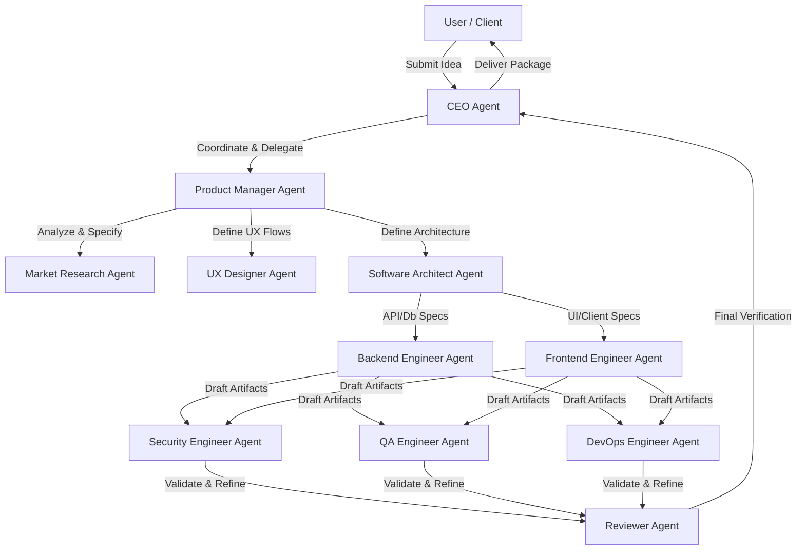
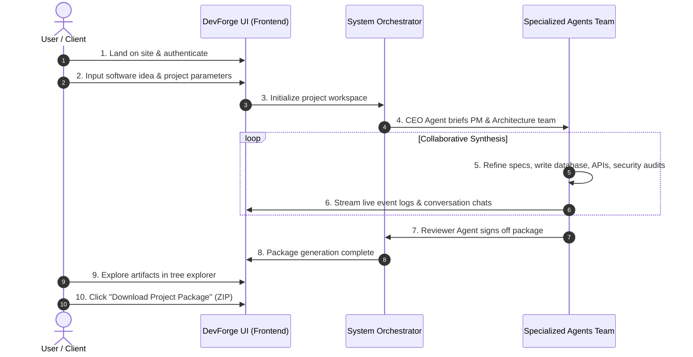

# Product Requirements Document: DevForge AI
**Version:** 1.0  
**Author:** Senior Product Manager  
**Date:** July 3, 2026  
**Status:** Ready for Engineering Review  

---

## Executive Summary

DevForge AI is an autonomous AI software company that transforms software ideas into production-ready engineering blueprints through structured collaboration between specialized AI agents. Rather than providing simple conversational responses or unstructured snippets of code, DevForge AI acts as a virtual engineering organization. Users interact as "clients" or "CEOs" collaborating with a team of virtual specialists—ranging from Product Managers and Security Engineers to QA and DevOps specialists—to receive a comprehensive, validated, and high-fidelity engineering package containing everything needed to kickstart or execute a software project.



---

## Table of Contents
1. [Background](#1-background)
2. [Problem Statement](#2-problem-statement)
3. [Solution](#3-solution)
4. [Goals & Success Criteria](#4-goals--success-criteria)
5. [Non-Goals (Version 1)](#5-non-goals-version-1)
6. [User Journey](#6-user-journey)
7. [Core Features](#7-core-features)
8. [Agent Definitions](#8-agent-definitions)
9. [System Workflow](#9-system-workflow)
10. [Functional Requirements](#10-functional-requirements)
11. [Non-Functional Requirements](#11-non-functional-requirements)
12. [Security & Protection](#12-security--protection)
13. [Technology Stack](#13-technology-stack)
14. [Engineering Artifacts Generated](#14-engineering-artifacts-generated)
15. [Future Roadmap](#15-future-roadmap)
16. [Risks & Mitigations](#16-risks--mitigations)
17. [Key Performance Indicators (KPIs)](#17-key-performance-indicators-kpis)
18. [Competitive Advantage](#18-competitive-advantage)

---

## 1. Background

Modern software development is inherently collaborative and multidisciplinary. Launching a high-quality product is rarely just a coding exercise; it requires a sequence of specialized skills:
* **Product Management** to refine scope, define user stories, and organize backlogs.
* **UX/UI Design** to map user flows, layout wireframes, and ensure accessibility.
* **Software Architecture** to choose the right tech stack, plan data models, and design system components.
* **Security Engineering** to identify vulnerabilities, safeguard user data, and check compliance.
* **Backend & Frontend Engineering** to implement robust APIs, logic, and client-side interfaces.
* **Quality Assurance** to construct testing suites, write test plans, and verify edge cases.
* **DevOps Engineering** to construct container setups, CI/CD pipelines, and cloud infrastructure code.

Solo developers, startups, indie hackers, and small technical teams face a severe constraint: they rarely possess all of these skill sets in-house. As a result, software is often built without proper architectural planning, leading to scaling issues, security vulnerabilities, poor test coverage, and unmaintainable codebases.

---

## 2. Problem Statement

### What problem exists today?
Building software requires coordinating multiple specialized disciplines. When a single developer or small team attempts to cover all these bases, they encounter a "context-switching tax" and gaps in expertise. Architecture suffers, security is treated as an afterthought, database schemas are sub-optimal, and testing is minimal.

### Why current AI chatbots are insufficient?
Current AI chatbots (such as ChatGPT, Claude, or basic copilots) operate primarily on a single-turn or simple conversational loop. 
1. **Lack of Context & Cohesion:** They do not maintain a unified architectural blueprint across different code blocks.
2. **"Yes-Man" Behavior:** Chatbots tend to agree with the user's initial assumptions, even if those assumptions lead to bad database designs or security flaws.
3. **No Peer Review:** They generate code or configurations without running secondary validation, compiler checks, or security auditing agents.
4. **Scope Creep & Fragmentation:** They lack the capability to output structured, multi-file engineering directories with synchronized data models, API specs, and deployment scripts.

### Why specialized collaborating agents are better?
A multi-agent system models real-world human organizations. By assigning clear, constrained roles (e.g., a Security Engineer who *only* critiques code for vulnerabilities, a Software Architect who *only* enforces system modularity), we create a system of "checks and balances." Agents review each other's work, request revisions, and enforce rigorous quality gates. This results in cohesive, secure, and production-ready blueprints rather than fragmented, copy-pasted code snippets.

### Why this problem matters for modern software development?
With the rise of AI-assisted coding, the bottleneck in software engineering is shifting from *writing lines of code* to *designing, verifying, and orchestrating complex systems*. Providing developers with complete, verified engineering blueprints prevents downstream development failures and significantly speeds up time-to-market.

---

## 3. Solution

**DevForge AI** is an autonomous multi-agent platform that translates high-level software ideas into a complete, verified "engineering package." 

### How it Works
1. **Ingestion:** The user submits a software idea, specifying target audience, core features, and preferred tech stack (optional).
2. **Briefing:** The CEO Agent coordinates the request and tasks the Product Manager to establish the initial project scope.
3. **Collaborative Planning:** The PM, Market Research, UX Designer, and Software Architect collaborate to produce a unified technical plan.
4. **Implementation & Refinement:** The Backend and Frontend Engineers write the detailed code skeletons, API specs, and schema files based on the architecture.
5. **Auditing & Testing:** The Security, QA, and DevOps agents review the code, generate test suites, and write infrastructure-as-code files.
6. **Review Gate:** The Reviewer Agent performs a static review against requirements and hands off the verified package to the CEO.
7. **Delivery:** The user receives a comprehensive ZIP archive containing a fully designed project blueprint alongside a live dashboard detailing the chat transcripts and logic behind every decision.

```
+-----------------------------------------------------------------------------------+
|                               DevForge AI Workspace                               |
+-----------------------------------------------------------------------------------+
| [Idea Input] --> [Agent Workspace: CEO / PM / Architect / Dev / QA / Sec / Ops]    |
|                         (Multi-Agent Live Log & Chat Visualizer)                  |
+-----------------------------------------------------------------------------------+
| [Artifact Explorer]                                                               |
|  ├── README.md              (Project overview & setup)                            |
|  ├── PRD.md                 (Fully detailed user stories & requirements)          |
|  ├── architecture.md        (System boundaries, C4 diagram representations)        |
|  ├── api_spec.yaml          (OpenAPI 3.0 specification)                           |
|  ├── database_schema.sql    (SQL schema with indexes & constraints)               |
|  ├── security_report.md     (Threat modeling & vulnerability assessment)          |
|  ├── test_plan.md           (E2E, Integration, Unit test specifications)          |
|  ├── deployment_guide.md    (Docker, CI/CD pipelines, Terraform configs)           |
|  └── sprint_backlog.md      (Jira-compatible markdown backlog items)             |
+-----------------------------------------------------------------------------------+
|                        [ DOWNLOAD COMPLETED PACKAGE (ZIP) ]                       |
+-----------------------------------------------------------------------------------+
```

### What makes it different from ChatGPT, Claude, Cursor, and Copilot?
* **Autonomous Workflows:** Instead of step-by-step user prompting, the user acts as the Client/Approver. The agents do the heavy lifting of collaborating, critiquing, and revising.
* **Blueprint Focus:** Instead of just outputting code snippets, it creates the entire scaffolding (database tables, API routes, security policy docs, test specs, and infrastructure setups) as a unified, compilable project blueprint.
* **Strict Quality Gates:** An agent's output is not final until the QA and Security agents approve it and the Reviewer Agent signs off.

### Value Provided
* **Reduces Time-to-Blueprint:** Shaves weeks off the planning, architecture, and prototyping phases down to minutes.
* **Enforces Industry Best Practices:** Automatically applies security hardening, scalability patterns, and database indexing strategies.
* **Empowers Non-Technical & Solo Founders:** Generates technical documents that can be handed directly to freelance developers, internal hires, or fed into code generators.

---

## 4. Goals & Success Criteria

### Business Goals
1. **User Acquisition:** Build a community of indie hackers, startup founders, and developers. Target 10,000 active projects created in the first 6 months post-launch.
2. **SaaS Conversion:** Convert at least 3% of free-tier users to premium subscriptions within 3 months of launching payment structures.
3. **Retention:** Achieve a 30-day user retention rate of >25% for recurring project managers and developers.

### User Goals
1. **Reduce Friction:** Enable users to move from an abstract concept to a structured technical blueprint in under 15 minutes.
2. **Ensure Accuracy:** Provide code blueprints that can compile/run immediately without obvious syntax or structural errors.
3. **Education:** Enable junior developers and product managers to learn best-practice architecture, security patterns, and testing strategies.

### Measurable Success Criteria
| Metric | Target | Measurement Method |
| :--- | :--- | :--- |
| **Blueprint Build Time** | < 10 Minutes (Average) | Server-side telemetry tracking execution time per project |
| **Syntax Validity** | 99% syntactically correct specs | Automated parser validation (OpenAPI, SQL formatters, markdown linters) |
| **Download Rate** | > 70% of completed projects downloaded | Event tracking on "Download Package" click |
| **CSAT Score** | > 4.5 / 5.0 | Post-generation user satisfaction micro-survey |

---

## 5. Non-Goals (Version 1)

To ensure focus and timely delivery of Version 1, the following features are explicitly out of scope:
1. **Generating Complete Production-Ready Applications:** DevForge AI will generate production-grade blueprints, folder scaffolding, schemas, configs, and architectural code, but it will *not* write 100% of the business logic or build the entire codebase.
2. **Replacing Software Engineers:** The product is designed to *empower* developers and architects with templates and specs, not replace the human engineer who finishes and maintains the software.
3. **Automatic Deployment to Production:** V1 will generate Terraform files, Dockerfiles, and GitHub Actions workflows, but it will *not* deploy these to the user's AWS/GCP/Vercel accounts.
4. **Live Code Editing Sandbox:** The product will not feature an in-browser IDE for editing code live; it is a blueprint generation engine.

---

## 6. User Journey



1. **Onboarding & Authentication:** The user visits the DevForge AI landing page and authenticates securely via GitHub, GitLab, or Google OAuth.
2. **Project Setup:** The user begins a new project build. The UI guides them through a questionnaire:
   - What is the name and primary function of your software?
   - Who is the intended target audience?
   - What is the preferred tech stack? (e.g., Python FastAPI backend, Next.js frontend, PostgreSQL database).
3. **The Live Workspace:** Upon submission, the user is transitioned to the project workspace. They observe:
   - A real-time chat visualizer showing the agents analyzing, outlining, debating, and constructing the project spec files.
   - A dynamically updating file tree loading templates and scaffolding in real-time.
4. **Human-in-the-Loop Feedback (Optional):** If critical conflicts arise, the CEO Agent presents choices to the user.
5. **Blueprint Exploration:** Once generation completes, the system unlocks the interactive file viewer. The user reviews schemas, API routes, security briefs, and task lists.
6. **Artifact Export:** The user clicks a download button to receive a compressed ZIP container of their repository structure.

---

## 7. Core Features

### 7.1 Idea Submission
* **Description:** An interactive, wizard-style interface that helps the user frame their software idea.
* **Details:** Includes autocomplete suggestions, framework selectors, and input prompts designed to extract target users, database preferences, and core business models.

### 7.2 Project Dashboard
* **Description:** The central hub where users monitor the generation process and view completed projects.
* **Details:** Displays project history, status badges (e.g., *Drafting, Under Audit, Reviewing, Completed*), and project metadata.

### 7.3 Multi-Agent Collaboration Panel
* **Description:** A split-pane view displaying the behind-the-scenes communication between agents.
* **Details:** Displays agent avatars and chat transcripts. Users can click on individual agent messages to understand *why* a design decision was made.

### 7.4 Live Progress Tracking
* **Description:** A visual timeline showing the status of the current generation run.
* **Details:** Shows phases: *Idea Analysis -> Architecture Design -> Code Scaffolding -> Security Review -> QA Planning -> Package Synthesis*.

### 7.5 Engineering Artifact Generation
* **Description:** The core engine that compiles agent outputs into structured files.
* **Details:** Synthesizes markdown documents, SQL schemas, OpenAPI specifications, configuration scripts, and documentation templates into a logical folder hierarchy.

### 7.6 Final Review
* **Description:** A dedicated interface summarizing the Reviewer Agent's feedback.
* **Details:** Lists potential risks, suggested developer steps, and outstanding items for human developers to implement first.

### 7.7 Downloadable Project Package
* **Description:** Generates a compressed `.zip` archive of the entire workspace.
* **Details:** The package maintains a standardized folder structure:
  ```
  /project-root
    ├── /docs (PRD, Architecture, Security Report)
    ├── /backend (API Specs, Database Schemas, Dockerfile)
    ├── /frontend (Scaffolding, Page layouts, components mockups)
    ├── /infra (Terraform scripts, CI/CD pipeline YAMLs)
    └── README.md
  ```

### 7.8 Session History & Workspace Retention
* **Description:** Saves past projects in the cloud.
* **Details:** Allows users to return to past generated blueprints, re-run generations with new parameters, or share links with teammates.

### 7.9 Project Export
* **Description:** Direct integration with external hosting and collaboration tools.
* **Details:** "Push to GitHub" button that directly creates a private or public repository on the user's authorized GitHub account.

---

## 8. Agent Definitions

This section defines the behavior, responsibilities, and tools used by each autonomous agent in the DevForge AI organization.

| Agent | Purpose | Primary Input | Primary Output | Dependencies |
| :--- | :--- | :--- | :--- | :--- |
| **CEO Agent** | Orchestrates the workspace, enforces deadlines, and manages user interaction. | User Prompt | Delegation commands, final delivery | None |
| **Product Manager** | Defines product scope, user stories, and features. | CEO directives, User Prompt | `PRD.md`, `sprint_backlog.md` | CEO Agent |
| **Market Research** | Identifies competitor features and targets user pain points. | User Prompt, PM scope | Competitor brief, feature recommendations | PM Agent |
| **UX Designer** | Designs user flows, pages, and components layouts. | `PRD.md` | Layout specs, wireframe schemas | PM Agent |
| **Software Architect** | Designs system boundaries, choose technology stacks, maps data. | `PRD.md`, UX Specs | `architecture.md` | PM & UX Designer |
| **Backend Engineer** | Scaffolds API endpoints and data model code. | `architecture.md` | `api_spec.yaml`, database schemas | Software Architect |
| **Frontend Engineer** | Creates UI components outlines and frontend route structures. | `architecture.md`, UX Specs | Client layouts, routing configurations | UX Designer, Architect |
| **Security Engineer** | Conducts threat modeling and security audits of code specs. | Backend/Frontend specs | `security_report.md` | BE & FE Engineers |
| **QA Engineer** | Formulates test strategies, unit test plans, and E2E specifications. | `PRD.md`, Backend specs | `test_plan.md` | PM & Backend Engineer |
| **DevOps Engineer** | Scaffolds Docker, CI/CD, and deployment templates. | `architecture.md` | `deployment_guide.md`, Dockerfiles, CI pipelines | Software Architect |
| **Reviewer Agent** | Performs final audit of the output files against requirements. | All generated files | Approval signature or revision requests | All Agents |

---

### 8.1 CEO Agent
* **Purpose:** Acts as the entry-point coordinator. It interprets user requirements, schedules agent tasks, and communicates project completion to the user.
* **Responsibilities:** Managing the orchestration queue, initiating agent tasks, assessing overall execution health, and handling final package delivery.
* **Inputs:** User idea prompt, user feedback, agent validation statuses.
* **Outputs:** Orchestration commands, interactive user prompts, final ZIP delivery.
* **Tools Used:** Orchestrator API, Message Queue, Artifact Packager.
* **Success Criteria:** Zero deadlocks in agent communication, delivery of complete package in < 15 minutes.

### 8.2 Product Manager Agent
* **Purpose:** Refine raw ideas into clear functional scopes, ensuring the team knows exactly what needs to be planned.
* **Responsibilities:** Drafting user stories, defining product features, specifying MVP boundaries, and creating the sprint backlog.
* **Inputs:** CEO directive, market research reports.
* **Outputs:** `PRD.md`, `sprint_backlog.md` (formatted markdown with epics and tasks).
* **Tools Used:** Text Generation Engine, Feature-Matrix Generator.
* **Success Criteria:** PRD lists all core user flows without architectural ambiguities.

### 8.3 Market Research Agent
* **Purpose:** Analyze market relevance and suggest unique differentiators or table-stakes features for the specified niche.
* **Responsibilities:** Evaluating the product concept against real-world competitors, listing similar products, and outlining opportunities for competitive advantage.
* **Inputs:** User idea prompt, PM product draft.
* **Outputs:** Competitor SWOT analysis and feature recommendation tables.
* **Tools Used:** Search Engine, Vector Database of modern SaaS platforms.
* **Success Criteria:** Provides at least three concrete, non-obvious features that enhance the target software's value proposition.

### 8.4 UX Designer Agent
* **Purpose:** Define user navigation flows and layout structures for the application frontend.
* **Responsibilities:** Establishing visual hierarchies, mapping user navigation states, outlining component structures, and setting up accessibility checklists.
* **Inputs:** `PRD.md`.
* **Outputs:** Page layouts, responsive navigation specs, design token requirements (colors, typography).
* **Tools Used:** Wireframe Layout Schema Generator.
* **Success Criteria:** Output matches WCAG AA contrast standards and logically connects all screens outlined in the PRD.

### 8.5 Software Architect Agent
* **Purpose:** Design the software system configuration, data flow, and components.
* **Responsibilities:** Choosing appropriate frameworks, defining system topology, designing sequence diagrams, and establishing data structures.
* **Inputs:** `PRD.md`, UX designer layouts.
* **Outputs:** `architecture.md` (containing component design, database choice rationale, and data flow plans).
* **Tools Used:** System Architecture Template Engine, Diagram Builder.
* **Success Criteria:** Architecture defines distinct components with clear boundaries (e.g., API Gateway, Backend API, Database layer).

### 8.6 Backend Engineer Agent
* **Purpose:** Detail the server-side operations, API designs, and database structures.
* **Responsibilities:** Drafting REST or GraphQL schemas, structuring SQL/NoSQL schema migrations, and outlining authorization/middleware patterns.
* **Inputs:** `architecture.md`, `PRD.md`.
* **Outputs:** `api_spec.yaml` (OpenAPI 3.0 compatible), `database_schema.sql` (schema file with indexes and relations).
* **Tools Used:** Swagger/OpenAPI validator, SQL Schema generator.
* **Success Criteria:** OpenAPI specification compiles without syntax errors; SQL files include clean primary/foreign keys and index targets.

### 8.7 Frontend Engineer Agent
* **Purpose:** Outline client-side components and states corresponding to user layouts.
* **Responsibilities:** Writing component directory trees, defining state-management requirements, and outlining API-client integrations.
* **Inputs:** `architecture.md`, UX designer layouts.
* **Outputs:** Client application directory structure, routing configs, API integration mock files.
* **Tools Used:** Frontend Scaffold Generator.
* **Success Criteria:** Layout files map 1:1 with frontend routes defined in the UX flow.

### 8.8 Security Engineer Agent
* **Purpose:** Audit the designed architectures and database patterns for vulnerabilities before code packaging.
* **Responsibilities:** Threat modeling, evaluating credential storage designs, checking OWASP Top 10 vulnerabilities, and reviewing RBAC implementations.
* **Inputs:** `api_spec.yaml`, `database_schema.sql`, `architecture.md`.
* **Outputs:** `security_report.md` (identifying threat vectors and listing mitigation steps).
* **Tools Used:** Static Code Analyzers, Vulnerability Database.
* **Success Criteria:** Security report lists at least five threat vectors with appropriate security controls implemented in backend config.

### 8.9 QA Engineer Agent
* **Purpose:** Prepare automated testing frameworks, test cases, and quality strategies.
* **Responsibilities:** Outlining unit testing configurations, integration test files, E2E test flows, and performance load test profiles.
* **Inputs:** `PRD.md`, `api_spec.yaml`.
* **Outputs:** `test_plan.md` alongside sample testing files.
* **Tools Used:** Test Suite Generator.
* **Success Criteria:** Test plan covers all critical user journeys defined in the PRD.

### 8.10 DevOps Engineer Agent
* **Purpose:** Create deployment patterns and infrastructure-as-code scaffolding for the application.
* **Responsibilities:** Constructing container files, building CI/CD workflow YAML templates, and drafting cloud infrastructure configs.
* **Inputs:** `architecture.md`, `database_schema.sql`.
* **Outputs:** `deployment_guide.md`, `Dockerfile`, `docker-compose.yml`, GitHub Actions pipelines, and basic Terraform templates.
* **Tools Used:** Dockerfile validator, IaC linter.
* **Success Criteria:** Formulates functional Docker and docker-compose configs that compile and link services (backend, frontend, database).

### 8.11 Reviewer Agent
* **Purpose:** Act as the final quality gate to ensure all deliverables align with the original requirements and compile properly.
* **Responsibilities:** Checking consistency across files, validating syntax, checking for placeholder text, and giving the final sign-off.
* **Inputs:** All generated artifacts from previous agents.
* **Outputs:** Review report, approval flag or revision requests back to CEO.
* **Tools Used:** Syntax validators, LLM check gates.
* **Success Criteria:** The package passes validation checks and matches all primary features defined in the PRD.

---

## 9. System Workflow

The DevForge AI agent workflow combines sequential dependencies with parallel execution blocks to maximize throughput and output consistency.

### 9.1 Phase 1: Planning (Sequential)
1. The **CEO Agent** initializes the workflow and hands off the prompt to the **Product Manager Agent**.
2. The **Product Manager** asks the **Market Research Agent** to identify competitors and critical user pain points.
3. Once market details are back, the **Product Manager** compiles the `PRD.md` and passes it to the **UX Designer Agent** and the **Software Architect Agent**.

### 9.2 Phase 2: Design & Scaffold (Parallel Execution)
Once the architecture and UX layouts are approved:
* The **Backend Engineer** begins generating the data schemas (`database_schema.sql`) and API designs (`api_spec.yaml`).
* Simultaneously, the **Frontend Engineer** builds out the client routing and UI scaffolding tree based on the UX Designer's screens.

### 9.3 Phase 3: Auditing & Verification (Parallel & Iterative)
Once the engineering blueprints are drafted:
* The **Security Engineer** reviews the backend APIs and architecture, producing the `security_report.md`.
* The **QA Engineer** creates `test_plan.md` maps based on the API spec and PRD.
* The **DevOps Engineer** reads the technology specifications from the architecture file to output the Dockerfiles and CI pipelines.

```
       [PM Drafts PRD]
              │
              ▼
   [Architect Maps Topology]
              │
       ┌──────┴──────┐
       ▼             ▼
[Backend Spec] [Frontend Spec]
       │             │
       ├─────────────┼─────────────┐
       ▼             ▼             ▼
 [QA Test Plan] [Sec Report] [DevOps Scaffolds]
       │             │             │
       └─────────────┼─────────────┘
                     ▼
             [Reviewer Audit]
```

### 9.4 Phase 4: Final Sign-off
1. The **Reviewer Agent** analyzes the entire set of output documents for cross-compatibility (e.g., ensuring backend endpoints match the frontend routing, and the database schema supports all PRD entities).
2. If discrepancies are found, the Reviewer requests revisions from specific agents (maximum of 2 revision loops to prevent infinite loops).
3. Once approved, the package is zipped and marked for download.

---

## 10. Functional Requirements

### 10.1 Idea Ingestion & Parameterization
* **FR-1.1:** The system MUST accept a free-form text prompt describing the user's software idea (minimum 10 characters, maximum 2000 characters).
* **FR-1.2:** The system MUST provide checkboxes for popular tech stack preferences (Backend: Node.js, Python, Go; Frontend: React, Vue, Next.js; Database: PostgreSQL, MySQL, MongoDB).
* **FR-1.3:** The system MUST allow users to select their target deployment platform (Docker-only, AWS, GCP, Vercel).

### 10.2 Agent Workspace & Conversation Streamer
* **FR-2.1:** The user interface MUST render a real-time message stream displaying conversations and tool logs of active agents.
* **FR-2.2:** Each message MUST clearly indicate the agent's name, role icon, timestamp, and target recipient.
* **FR-2.3:** The streamer MUST support auto-scrolling to the latest agent actions, with the ability to pause auto-scroll if the user scroll up.

### 10.3 Artifact Tree Explorer
* **FR-3.1:** The UI MUST display a hierarchical directory tree of generated artifacts on the left side of the screen once generation starts.
* **FR-3.2:** Clicking a file in the tree MUST render its contents in a syntax-highlighted editor view (supporting Markdown, YAML, SQL, and code files).
* **FR-3.3:** The editor view MUST support search (Ctrl+F) within the document.

### 10.4 Execution Controls
* **FR-4.1:** The user MUST have the ability to click "Cancel" during generation, which immediately terminates all active agent processes.
* **FR-4.2:** The system MUST support "Restart" to wipe existing artifacts and run the generation loop again using the same parameters.
* **FR-4.3:** If an agent encounters a fatal error, the system MUST display a clear error alert indicating which agent failed and offer a retry option.

### 10.5 Project Archiving & Exporting
* **FR-5.1:** Users MUST be able to download the entire generated blueprint structure as a single ZIP file containing all generated files.
* **FR-5.2:** The ZIP file structure MUST follow the layout defined in Section 14 (Engineering Artifacts).
* **FR-5.3:** If authenticated with GitHub, the system MUST allow users to click "Export to GitHub" to create a new repository and push the generated blueprints directly.

---

## 11. Non-Functional Requirements

### 11.1 Performance & Response Times
* **NFR-1.1 (Latency):** Individual agent responses within the orchestration loop should resolve in under 15 seconds.
* **NFR-1.2 (Concurrency):** The system must support up to 50 concurrent generation sessions without degradation in response times or API timeout.
* **NFR-1.3 (Asset Size):** The final downloadable ZIP package must be compressed dynamically and download in less than 3 seconds on a standard 10Mbps connection.

### 11.2 Reliability & Fault Tolerance
* **NFR-2.1 (Resiliency):** If a single non-blocking agent (e.g., Market Research) fails, the workflow must continue, fallback to default templates, and log the failure.
* **NFR-2.2 (SLA):** The SaaS platform API must achieve 99.9% uptime (excluding planned maintenance windows).
* **NFR-2.3 (Save States):** The system must save intermediate artifacts in the database during generation. If a user connection is lost, they can refresh and resume viewing the state.

### 11.3 Usability & Design
* **NFR-3.1 (Responsive Design):** The workspace dashboard must be fully responsive, functioning smoothly on desktop viewports (1280px+) and tablets (768px+).
* **NFR-3.2 (Aesthetic Standards):** The UI must utilize a dark-mode theme, utilizing modern font systems (e.g., Outfit or Inter), smooth CSS transitions, and colored status pill identifiers for agent states.
* **NFR-3.3 (Accessibility):** The workspace interface must achieve WCAG 2.1 Level AA compliance, featuring appropriate `aria-*` tags and keyboard-navigable dialogs.

---

## 12. Security & Protection

To protect the platform and users during autonomous execution, the system must enforce strict security guidelines:

### 12.1 Prompt Injection Protection
All user inputs must go through an automated moderation filter using a specialized security guardrail model (e.g., Llama-Guard or equivalent LLM prompt checking) before being passed to agents. Any prompt detected to contain system bypass instructions or code injection attacks must be blocked immediately.

### 12.2 Read-Only Tool Limits
Agents do not have execution privileges on the backend server. All agent-accessible tools must operate under a read-only or sandboxed environment. File writing operations are managed by a centralized, sandboxed supervisor filesystem layer that validates file extensions and content sizes.

### 12.3 API Key Management
* Users can provide their own LLM API keys (OpenAI, Anthropic, Gemini) or buy platform credits.
* If keys are provided, they must be encrypted at rest using AES-256-GCM and never logged, exposed in the browser, or shared in agent-to-agent conversation logs.

### 12.4 Secret Redaction
The system orchestrator must intercept all agent console outputs and file generations to search for and redact sensitive strings (API keys, OAuth tokens, DB passwords) before they are written to disk or displayed to the user.

---

## 13. Technology Stack

We recommend the following production-ready technology stack to build DevForge AI:

| Layer | Recommended Technology | Rationale |
| :--- | :--- | :--- |
| **Frontend Framework** | **Next.js 14 (App Router)** / React | SSR for landing page SEO; robust route handlers for workspace loading. |
| **Styling** | **Vanilla CSS + CSS Modules** | Ensures maximum layout flexibility, smooth animations, and optimized load times. |
| **Backend Server** | **FastAPI (Python)** | High-performance async support, built-in validation (Pydantic), and seamless integration with AI agent frameworks. |
| **Database** | **PostgreSQL (Supabase)** | Handles complex relational schemas, user accounts, project states, and session storage. |
| **LLMs** | **Gemini 1.5 Pro / Claude 3.5 Sonnet** | Large context windows allow agents to keep long architecture documents and PRDs in context during iterations. |
| **Agent Framework** | **LangGraph / CrewAI** | Allows design of complex, stateful multi-agent workflows with loops, conditional branches, and parallel executions. |
| **File Storage** | **AWS S3 / Supabase Storage** | Fast, secure storage for storing generated ZIP packages and project historical files. |
| **Authentication** | **NextAuth.js (Auth.js)** | Seamless support for GitHub, GitLab, and Google OAuth integrations. |
| **Deployment & Hosting** | **Vercel** (Frontend) & **Render/AWS ECS** (Backend) | Combines fast, global edge caching for the UI with scalable container compute for agent loops. |

---

## 14. Engineering Artifacts Generated

DevForge AI produces a standard set of output files inside the project package:

### 1. `README.md`
* **Purpose:** Explains the project structure, developer pre-requisites, setup instructions, and details on how to run local builds.

### 2. `PRD.md` (Product Requirements Document)
* **Purpose:** Written by the PM Agent, this contains the feature scope, target personas, functional/non-functional requirements, and detailed user stories.

### 3. `architecture.md`
* **Purpose:** Outlines the software architecture, selected framework configurations, logical data flow diagram definitions, and database structures.

### 4. `api_spec.yaml`
* **Purpose:** An OpenAPI 3.0-compliant configuration specifying server routes, request body requirements, status codes, and return shapes.

### 5. `database_schema.sql`
* **Purpose:** SQL file defining database tables, relation keys, constraints, and optimization indexes.

### 6. `security_report.md`
* **Purpose:** Evaluates system security, identifying possible attack vectors, threat modeling scenarios, and compliance controls (e.g., GDPR, HIPAA).

### 7. `test_plan.md`
* **Purpose:** Maps QA strategy, showing unit test targets, manual test check sequences, and configuration instructions for testing suites.

### 8. `deployment_guide.md`
* **Purpose:** Explains how to deploy the application, detailing environment variables, container steps, and CI/CD pipelines.

### 9. `sprint_backlog.md`
* **Purpose:** A structured backlog of tasks organized by Epics, formatted in markdown to allow direct copying into tool suites (like Jira or GitHub Issues).

---

## 15. Future Roadmap

```
+------------------------------------+
|  V1: Scaffolding & Spec Engine     |
+------------------------------------+
                  │
                  ▼
+------------------------------------+
|  V2: Live Interactivity & Custom   |
|      Agent Training                |
+------------------------------------+
                  │
                  ▼
+------------------------------------+
|  V3: Multi-Repo Scaffolding &      |
|      1-Click Cloud Staging         |
+------------------------------------+
```

### Version 2: Interactive Collaborations & Logic Scaffolders
* **Interactive Agents Chat:** Let users join the agent conversations directly to provide guidance, redirect decisions, or veto designs before code generation starts.
* **Component Wireframe Generators:** Generate actual React/HTML component layout files using design systems like Tailwind.
* **Agent Customization:** Allow companies to import their own custom style guides, lint rules, and architectural guidelines for agents to follow.

### Version 3: Deployment Pipelines & Multi-Repo Orchestrator
* **1-Click Staging Deployment:** Allow users to instantly host the frontend scaffolding and database mockups on DevForge managed servers to verify the layout.
* **Automatic Code Synchronization:** Synchronize generated blueprints directly with existing repositories via a GitHub App, raising PRs when designs change.
* **Multi-Microservice Blueprints:** Scaffold multi-repository applications complete with Docker Compose networking and shared protocol buffers.

---

## 16. Risks & Mitigations

### 16.1 Hallucinations in System Designs
* **Risk:** Agents might suggest non-existent packages, obsolete framework features, or make assumptions that break compile checks.
* **Mitigation:** Integrate automated linting and syntax validation scripts into the Reviewer Agent's workflow. Any code schemas (SQL, OpenAPI) must pass internal parser checks before the package is finalized.

### 16.2 Agent Communication Deadlocks
* **Risk:** Loop patterns (e.g., Security Agent rejects Backend, Backend fixes, Security rejects again) could lead to infinite loops, running up high LLM costs and causing timeouts.
* **Mitigation:** Implement strict limits on agent iterations (e.g., maximum of 2 revision attempts per step). If the limit is reached, flag the issue to the human user for decision resolution.

### 16.3 Cost & Token Management
* **Risk:** Running 11 agents recursively on large LLM models can result in high token costs per generation, squeezing SaaS profit margins.
* **Mitigation:** Implement aggressive caching of standard templates, use smaller models (like Gemini Flash) for initial checks and summaries, and reserve high-power models (like Gemini Pro or Claude Sonnet) for final code assembly and reviews.

---

## 17. Key Performance Indicators (KPIs)

To track the performance, quality, and business success of the DevForge AI platform, the engineering and product teams will monitor the following key metrics:

* **Generation Success Rate:** Percentage of started project runs that complete successfully without agent crashes or timeouts. Target: > 98%.
* **Average Time to ZIP:** The average time elapsed from prompt submission to package availability. Target: < 10 minutes.
* **User Downstream Conversion:** The percentage of users who export their project directly to GitHub or download the package. Target: > 70% of generated runs.
* **Revision Loop Frequency:** The number of times the Reviewer Agent sends feedback back to the engineering agents. Lower is better, indicating agents are hitting standards on the first attempt. Target: < 1.2 average loops.
* **Token Cost per Completed Blueprint:** The financial cost of LLM queries per successfully generated package. Target: < $0.75 per run.

---

## 18. Competitive Advantage

DevForge AI positions itself distinctively in the current generative AI space:

```
                  High Autonomy
                        ▲
                        │
                        │        * DevForge AI
                        │    (Collaborating Specialists)
                        │
                        │
                        │
Single-Agent   ─────────┼─────────► Multi-Agent
(Conversational)        │
   * ChatGPT            │
   * Claude             │
                        │
                        │        * Cursor / Copilot
                        │     (Inline Code Assistance)
                        ▼
                   Low Autonomy
```

* **Conversational AI (ChatGPT / Claude):** While excellent at general-purpose coding questions, they require constant guidance and are prone to fragmented context. DevForge AI runs autonomously to build consistent systems across multiple documents.
* **Inline Copilots (GitHub Copilot / Cursor):** These tools operate inside existing files to autocomplete code. They excel at code-completion but do not design full applications or write multi-discipline specifications (like test plans, deployment configs, and security checklists) from a single prompt.
* **Autonomous Agents (DevForge AI Advantage):** By organizing agents as a virtual software company, DevForge AI guarantees a product layout that covers UX, security, structure, QA, and operations. Each agent performs its role, reviews others, and ensures the client receives a structured, cohesive, and validated output.
