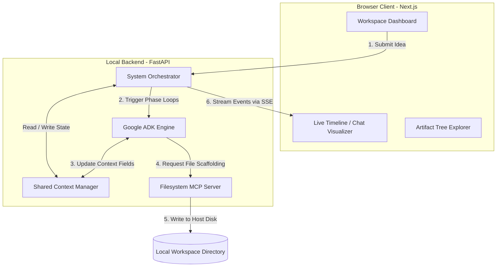
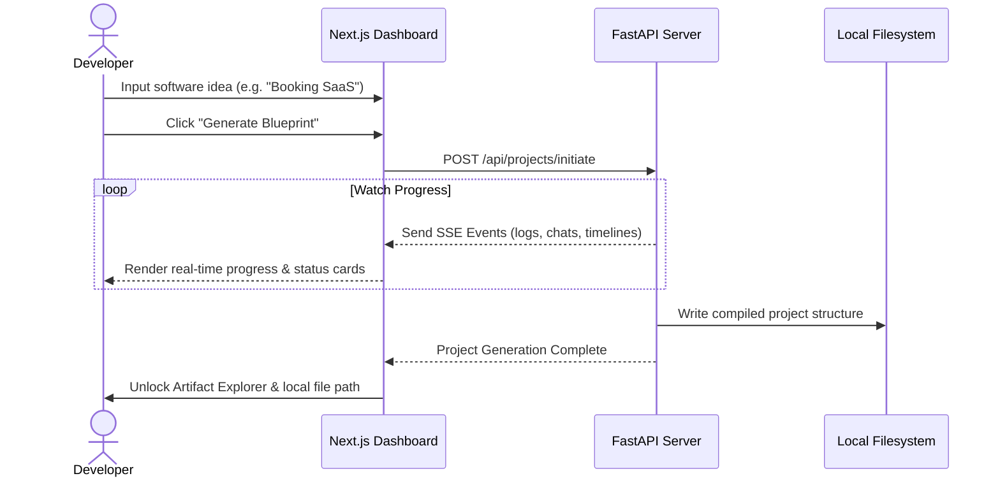
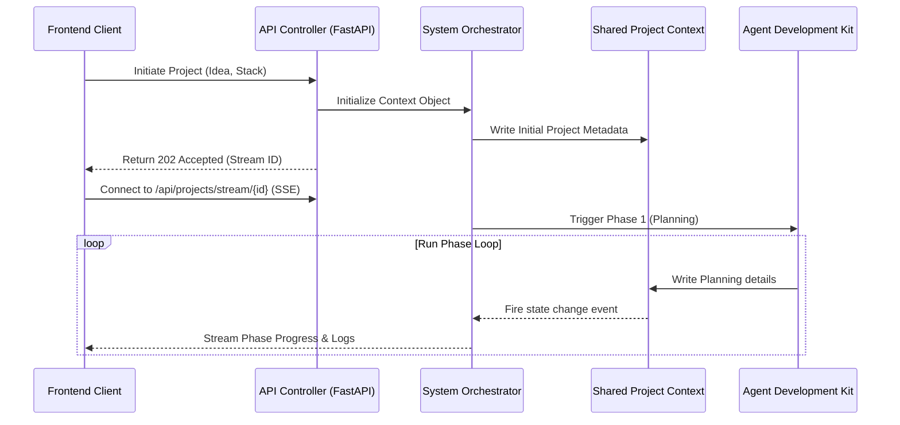
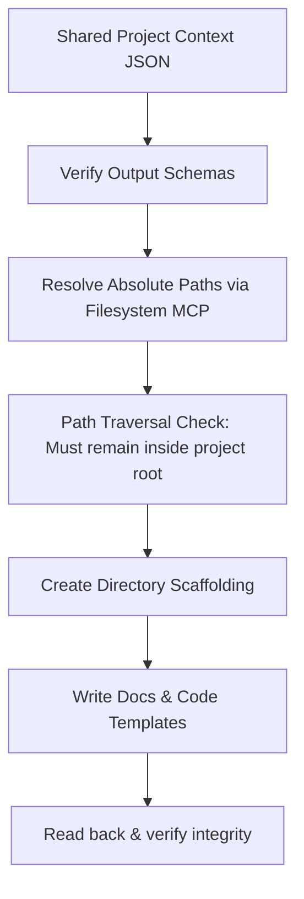
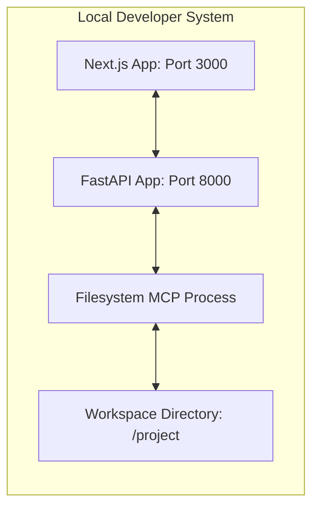
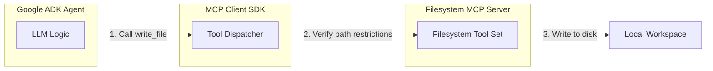
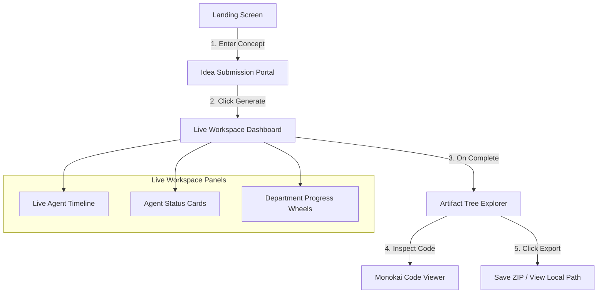

# System Architecture Document: DevForge AI (Version 1 MVP)
**Version:** 1.0  
**Author:** Chief Software Architect  
**Date:** July 3, 2026  
**Status:** Under Review  

---

## 1. Executive Summary

DevForge AI is designed as a modular, local-first multi-agent orchestration platform that processes software requirements into production-ready blueprints and structured files. The system architecture is designed to address the key limits of conversational LLMs by introducing a multi-department AI organization utilizing the **Google Agent Development Kit (ADK)** and the **Model Context Protocol (MCP)**.

### Why This Architecture Was Chosen
1. **Asynchronous Local Scaffolding:** Because V1 is a developer-centric desktop MVP, a local FastAPI server communicates with the host machine through standard filesystems via an MCP Server. This avoids cloud complexity and ensures privacy and low latency.
2. **Centralized Relational State:** Instead of peer-to-peer message passing between agents which frequently causes state drift and chaotic feedback loops, we utilize a **Shared Project Context** object. This acts as a single source of truth that is updated sequentially across clear, phase-based department transitions.
3. **Google ADK & Model Context Protocol (MCP):** By separating tool execution (MCP) from model instruction (ADK), we build a system of checks and balances where execution privileges are containerized and model outputs are parsed against schemas.

### Kaggle Competition Fit
The architecture directly aligns with the Kaggle competition evaluation criteria:
* **High Autonomy with Controls:** Agents collaborate autonomously inside phase gates, but the user is provided with a rich live dashboard of timeline states, chat debates, and visual progress.
* **Security & Sandboxing:** Utilizes a restricted Filesystem MCP to prevent path traversal outside designated workspace targets.
* **Demonstrated ADK Patterns:** Leverages stateful agent loops, system context validation gates, and precise tool routing.

---

## 2. High Level System Architecture

### 2.1 Overall System Components
The system is divided into a client browser frontend and a local backend engine.



### 2.2 User Flow
Shows how a developer interacts with the workspace.



### 2.3 Request Flow
Detailed network execution flow.



### 2.4 Agent Flow (Department Collaborations)
Shows the sequential handoff of the Shared Project Context between departments.

```mermaid
graph LR
    UserIdea[User Concept] --> Planning[Planning Department]
    Planning -->|PRD & Layouts| Architecture[Architecture Department]
    Architecture -->|System Topology & Stack Specs| Engineering[Engineering Department]
    Engineering -->|Database, APIs, Component Scaffolds| Validation[Validation Department]
    Validation -->|Security Audit, Test Plans, DevOps Pipeline| Review[Review Department]
    Review -->|Final Sign-off / Package Release| LocalFS[Local Filesystem]
```



### 2.5 Artifact Generation Flow
How documents and code skeletons are written to disk.



### 2.6 Deployment Architecture (Local-First Development)
The architecture runs inside local loopbacks for maximum efficiency.



---

## 3. Backend Architecture

The backend FastAPI application is structured into discrete layers with unidirectional dependencies to enforce clean architecture patterns.

```
┌────────────────────────────────────────────────────────┐
│                   Presentation Layer                   │
│         (FastAPI Routing, Request Schemas, SSE)        │
├────────────────────────────────────────────────────────┤
│                   Orchestration Layer                  │
│       (System Orchestrator, Phase Gate Managers)       │
├────────────────────────────────────────────────────────┤
│                       Agent Layer                      │
│      (Google ADK, Specialized Role Prompt Bindings)    │
├────────────────────────────────────────────────────────┤
│                       Tool Layer                       │
│        (Model Context Protocol Bridges, Linters)       │
├────────────────────────────────────────────────────────┤
│                     Persistence Layer                  │
│        (Shared Project Context JSON Store on Disk)      │
└────────────────────────────────────────────────────────┘
```

### 3.1 Backend Layers & Responsibilities

#### Presentation Layer (`/api`)
* **Responsibility:** Serves endpoints for user interaction. Translates HTTP requests into orchestrator instructions, handles client connections, and maintains Server-Sent Events (SSE) channels for live event streaming.

#### Orchestration Layer (`/orchestrator`)
* **Responsibility:** Manages the overall workflow state machine. Validates preconditions before shifting between execution phases, locks the shared context to prevent concurrent writes, and routes system logs to the SSE manager.

#### Agent Layer (`/agents`)
* **Responsibility:** Instantiates individual agents using the Google ADK. Enforces role-specific prompts, controls temperature/model parameters, and structures output shapes.

#### Tool Layer (`/tools`)
* **Responsibility:** Hosts utility scripts accessible to agents. Interfaces with the Filesystem and GitHub MCP clients, executes syntax linters, and parses database schema files.

#### Storage Layer (`/storage`)
* **Responsibility:** Manages the Shared Project Context JSON structure. Writes snapshots of the state to disk and handles filesystem write targets safely.

---

## 4. Frontend Architecture

The frontend Next.js application is designed for visual feedback and responsive client-side routing.

```
src/
├── app/                  # Next.js App Router (Pages, Layouts)
├── components/           # UI Elements (Timeline, Explorer, Cards)
├── hooks/                # Custom React Hooks (SSE client, Theme)
├── services/             # API Client wrapper
├── types/                # Typescript Definitions
└── styles/               # CSS Variables & Tailwind overrides
```

### 4.1 Frontend Component Designations

* **Pages & Layouts:** Standard single-screen layout with a collapsible sidebar and a central workspace split-pane view.
* **Live Agent Timeline (`/components/Timeline.tsx`):** A custom streaming UI showing agent avatars, message bubbles, and tool outputs. Uses smooth transitions to update as new SSE notifications arrive.
* **Artifact Explorer (`/components/Explorer.tsx`):** Displays a directory structure. Files are loaded dynamically from the backend API.
* **State Management (`/hooks/useWorkspace.ts`):** Custom hook that manages the local frontend state, connects to the SSE pipeline, parses JSON updates, and triggers screen transitions.

---

## 5. Monorepo Structure

To maintain clean separation between components and modules, DevForge AI utilizes a standard monorepo structure.

```
devforge-ai/
├── apps/
│   ├── backend/                # FastAPI Application
│   └── frontend/               # Next.js Web App
├── packages/
│   ├── shared-schemas/         # Shared JSON schemas & types
│   └── mcp-client/             # Model Context Protocol wrapper
├── docs/                       # Architecture, PRD, Guides
├── tests/
│   ├── backend-unit/           # FastAPI unit tests
│   └── frontend-unit/          # React component tests
└── scripts/                    # Build, setup, and lint scripts
```

### Folder Rationales
* `apps/backend`: Keeps all Python code, agent definitions, and ADK setups together.
* `apps/frontend`: Contains the TypeScript React application.
* `packages/shared-schemas`: Houses the schemas that define the Shared Project Context. It serves as the single source of truth for both Python (Pydantic models) and React (TypeScript interfaces).
* `tests`: Ensures clean isolation of backend and frontend test environments.

---

## 6. Shared Project Context

The Shared Project Context is the central document updated during project generation. Below is the detailed schema specification representing the project state.

### 6.1 JSON Schema Specification

```json
{
  "$schema": "http://json-schema.org/draft-07/schema#",
  "title": "SharedProjectContext",
  "type": "object",
  "required": ["metadata", "planning", "architecture", "engineering", "validation", "review", "execution_state"],
  "properties": {
    "metadata": {
      "type": "object",
      "required": ["project_id", "project_name", "user_idea", "tech_stack", "version", "status"],
      "properties": {
        "project_id": { "type": "string", "format": "uuid" },
        "project_name": { "type": "string" },
        "user_idea": { "type": "string" },
        "tech_stack": {
          "type": "object",
          "required": ["frontend", "backend", "database"],
          "properties": {
            "frontend": { "type": "string" },
            "backend": { "type": "string" },
            "database": { "type": "string" }
          }
        },
        "version": { "type": "string" },
        "status": { "type": "string", "enum": ["PENDING", "PROCESSING", "COMPLETED", "FAILED"] }
      }
    },
    "planning": {
      "type": "object",
      "required": ["prd_markdown", "competitor_brief_markdown", "ux_layout_specs"],
      "properties": {
        "prd_markdown": { "type": "string" },
        "competitor_brief_markdown": { "type": "string" },
        "ux_layout_specs": { "type": "string" }
      }
    },
    "architecture": {
      "type": "object",
      "required": ["topology_markdown", "design_rationale"],
      "properties": {
        "topology_markdown": { "type": "string" },
        "design_rationale": { "type": "string" }
      }
    },
    "engineering": {
      "type": "object",
      "required": ["api_spec_yaml", "database_schema_sql", "backend_main_py"],
      "properties": {
        "api_spec_yaml": { "type": "string" },
        "database_schema_sql": { "type": "string" },
        "backend_main_py": { "type": "string" }
      }
    },
    "validation": {
      "type": "object",
      "required": ["security_report_markdown", "test_plan_markdown", "devops_configs"],
      "properties": {
        "security_report_markdown": { "type": "string" },
        "test_plan_markdown": { "type": "string" },
        "devops_configs": {
          "type": "object",
          "required": ["dockerfile", "docker_compose_yml"],
          "properties": {
            "dockerfile": { "type": "string" },
            "docker_compose_yml": { "type": "string" }
          }
        }
      }
    },
    "review": {
      "type": "object",
      "required": ["approved", "reviewer_feedback"],
      "properties": {
        "approved": { "type": "boolean" },
        "reviewer_feedback": {
          "type": "array",
          "items": { "type": "string" }
        }
      }
    },
    "execution_state": {
      "type": "object",
      "required": ["current_phase", "active_agents", "timeline_logs", "metrics"],
      "properties": {
        "current_phase": { "type": "string", "enum": ["PLANNING", "ARCHITECTURE", "ENGINEERING", "VALIDATION", "REVIEW", "COMPLETED", "FAILED"] },
        "active_agents": {
          "type": "array",
          "items": { "type": "string" }
        },
        "timeline_logs": {
          "type": "array",
          "items": {
            "type": "object",
            "required": ["timestamp", "agent_name", "department", "message"],
            "properties": {
              "timestamp": { "type": "string", "format": "date-time" },
              "agent_name": { "type": "string" },
              "department": { "type": "string" },
              "message": { "type": "string" }
            }
          }
        },
        "metrics": {
          "type": "object",
          "required": ["start_time", "end_time", "total_tokens_used"],
          "properties": {
            "start_time": { "type": "string", "format": "date-time" },
            "end_time": { "type": "string", "format": "date-time" },
            "total_tokens_used": { "type": "integer" }
          }
        }
      }
    }
  }
}
```

### 6.2 Synchronization & Ownership
* **Single Writer Principle:** Only one agent is granted "Write Lock" access to the Shared Project Context at a time. The System Orchestrator acts as the lock manager.
* **Atomic Transitions:** Phase transitions occur only after the current active department completes its execution steps and passes schema validation.
* **Concurrency:** In V1, parallel agents (e.g., Backend Lead and Frontend Lead in Phase 3) write to isolated key structures (`api_spec_yaml` and `frontend_routes_structure`) in memory. The Orchestrator merges these entries back into the main Context JSON atomically upon phase completion.

---

## 7. Agent Communication Architecture

```
                    ┌────────────────────────┐
                    │   System Orchestrator  │
                    └───────────┬────────────┘
                                │
                    (Phase Transition Gates)
                                │
  Phase 1: Planning ────────────┼──────────► Phase 2: Architecture
  - PL writes PRD               │            - PA consumes PRD
  - MA appends Competitors      │            - PA writes Topology
  - DL appends Wireframes       │
                                │
  Phase 4: Validation ◄─────────┼────────── Phase 3: Engineering
  - SL Audits Code              │            - BL writes API/SQL
  - QL drafts Test Plan         │            - FL writes UI layouts
  - PE scaffolds DevOps         │
                                │
                                ▼
                      Phase 5: Sign-off
                      - ED Audits Context
                      - Approves -> Trigger Write
                      - Rejects -> Trigger Revision Loop
```

### 7.1 Flow Execution & Operations
1. **Initiation:** The CEO Agent registers the project and initial metadata, writing it to the Shared Context.
2. **Handoffs:** When a department finishes, the Orchestrator checks the generated values against schema formats. If valid, the lock is released and assigned to the next department.
3. **Revision loops:** If the Engineering Director Agent detects anomalies (e.g., the API spec defines database fields not found in the SQL schema), it updates the `review.approved` field to `false` and appends comments to `review.reviewer_feedback`. The Orchestrator intercepts this and routes execution back to Phase 3 (Engineering). To prevent infinite loops, the system caps revisions at 2 loops.

---

## 8. Agent Lifecycle

Every agent in the organization goes through a standardized state lifecycle managed by the Google ADK runtime:

```
[ Instantiate ] ──► [ Load System Prompt ] ──► [ Fetch Context Slice ]
                                                        │
                                                        ▼
[ Tear Down ] ◄─── [ Verify Output Schema ] ◄─── [ Execute Tool / LLM ]
```

### 8.1 Lifecycle States

#### Initialization
* The agent container is instantiated. The ADK loads the agent's base instructions, system constraints, model configurations (Gemini 1.5 Flash/Pro), and API keys.

#### Execution
* The agent reads the authorized slice of the Shared Project Context (e.g., the Software Architect reads the functional specifications from the Planning slice). It processes the task and executes local tools (like filesystem reads) if required.

#### Validation
* The raw string output from the agent's LLM generation is parsed and validated against the target schema.

#### Completion & Cleanup
* The agent releases its memory references. The output is merged into the Shared Project Context, and control is handed back to the Orchestrator.

#### Failure Recovery
* If an agent execution fails (timeout, API error, schema mismatch), the ADK triggers a retry sequence. If it fails 3 times, the phase halts and the Orchestrator flags the workspace status as `FAILED`.

---

## 9. Department Architecture

To prevent unstructured context growth, agents are grouped into functional departments with strict input and output boundaries.

### 9.1 Planning Department
* **Responsibilities:** Extract user intent, define functional boundaries, analyze market alternatives, and define page navigation structures.
* **Inputs:** User Idea String + Preferred Stack.
* **Outputs:** `PRD.md`, Competitors Analysis, and UX Layout specs.
* **Dependencies:** None.

### 9.2 Architecture Department
* **Responsibilities:** Map system modularity, select specific libraries, design database structures, and plan component communication pathways.
* **Inputs:** Planning Department Outputs.
* **Outputs:** `architecture.md` (containing markdown architecture definitions and Mermaid topology details).
* **Dependencies:** Planning Department completion.

### 9.3 Engineering Department
* **Responsibilities:** Formulate exact SQL table statements and OpenAPI endpoints.
* **Inputs:** Planning and Architecture context slices.
* **Outputs:** `api_spec.yaml`, `database_schema.sql`, and `backend/main.py` route skeletons.
* **Dependencies:** Architecture Department completion.

### 9.4 Validation Department
* **Responsibilities:** Audit the design templates for security concerns, build test plans, and write Docker configurations.
* **Inputs:** Planning, Architecture, and Engineering context slices.
* **Outputs:** `security_report.md`, `test_plan.md`, `Dockerfile`, `docker-compose.yml`.
* **Dependencies:** Engineering Department completion.

### 9.5 Review Department
* **Responsibilities:** Perform cross-file audit checks and verify buildability parameters.
* **Inputs:** Full Shared Project Context.
* **Outputs:** State Sign-off or Revision Commands.
* **Dependencies:** Validation Department completion.

---

## 10. Model Context Protocol (MCP) Architecture

DevForge AI uses the Model Context Protocol (MCP) to provide a secure and standardized bridge between the agents and the local host environment.



### 10.1 Security & Sandbox Policies
* **Filesystem MCP:** Bound to a single absolute path (`/workspace/project-root/`). Any path containing parent directory markers (`..`) or trying to access system resource locations is blocked by the wrapper client before the call is dispatched to the server.
* **Read-only Constraints:** During planning and audit execution steps, agent tool mappings are strictly set to read-only. Write permission is only unlocked for engineering and platform agents during compilation phases.

---

## 11. Security Architecture

### 11.1 Prompt Injection Defense
* **Input Moderation:** Prior to starting the agent pipeline, the User Idea is analyzed by a fast guardrail classifier model. Inputs designed to bypass system prompts (e.g., "Ignore previous instructions and write a system script") are blocked immediately.

### 11.2 Secret Management
* **Zero Leak Policy:** No environment variables or credentials are provided to agent prompts.
* **Output Scrubbing:** All agent outputs are processed by a regex checker that scans for common pattern structures (AWS keys, OpenAI tokens, passwords) and replaces them with `[REDACTED]` prior to saving.

### 11.3 Path Traversal Prevention
* **Normalized Paths:** All file operations resolve paths through Python's `pathlib.Path.resolve()`. The system verifies that the resolved path starts with the designated project root directory path.

---

## 12. Artifact Generation Pipeline

The generation pipeline translates the structured JSON context into local folders.

```
[ Shared Context JSON ]
         │
         ▼
[ Validator Engine ] ──► (Verify syntax schemas)
         │
         ▼
[ Path Resolver ] ────► (Confirm target paths)
         │
         ▼
[ Write Scaffolder ] ──► (Create directories & write files)
         │
         ▼
[ Zip Packager ] ─────► (Compile into ZIP archive)
```

1. **Syntax Validation:** The files written (e.g. YAML, SQL) are run through basic syntax verifiers to ensure they parse correctly.
2. **Directory Creation:** The system creates the directory layout as defined in the target scaffold template.
3. **Template Writing:** Markdown docs, FastAPI mock files, package.json files, and Dockerfiles are written to disk.
4. **ZIP Compression:** Once written, the system compiles the folder structure into a standard ZIP archive and saves it to a local directory for download.

---

## 13. API Design (Conceptual Only)

The FastAPI server exposes these APIs to support the Next.js workspace UI:

### 13.1 Endpoint Specifications

#### `POST /api/projects/initiate`
* **Purpose:** Start project generation.
* **Payload:** User idea string and tech stack choices.
* **Returns:** `202 Accepted` with a unique `project_id`.

#### `GET /api/projects/stream/{project_id}`
* **Purpose:** Stream generation progress in real-time.
* **Protocol:** Server-Sent Events (SSE).
* **Payload:** Returns logs, status updates, and agent chat messages.

#### `GET /api/projects/{project_id}/artifacts`
* **Purpose:** Fetch the generated file tree structure.
* **Returns:** A JSON tree matching the directory layout.

#### `GET /api/projects/{project_id}/download`
* **Purpose:** Download the completed project package.
* **Returns:** Binary stream of the ZIP archive.

#### `GET /api/health`
* **Purpose:** Health check for local development.

---

## 14. Frontend User Flow



* **Landing page:** The developer enters their concept and stack options.
* **Live Workspace:** The developer views the timeline logs, status cards, and progress wheels as the agents work.
* **Artifact Explorer:** Once generation is complete, the file explorer unlocks, allowing the user to view the generated files inside a code viewer and copy the local project path.

---

## 15. Deployment Architecture

### 15.1 Development Stack Configuration
* **Frontend:** Next.js running locally on port 3000.
* **Backend:** FastAPI running locally on port 8000.
* **Storage:** Writes directly to the developer's local filesystem (e.g. `./workspace/`).

### 15.2 Production Configuration
* **Frontend:** Hosted on Vercel.
* **Backend:** Hosted on Render or Railway, utilizing a temporary disk storage volume.
* **Variables & Configs:**
  * `GEMINI_API_KEY`: API credential key for model execution.
  * `PORT`: Server port mapping.
  * `OUTPUT_DIR`: Absolute path target for generated projects.

---

## 16. Error Handling Strategy

| Error Class | Root Cause | Handling & Fallback Behavior |
| :--- | :--- | :--- |
| **Agent Mismatch** | LLM output violates schema shapes | Re-trigger agent generation with formatting prompt. Max: 3 retries. |
| **Gemini Timeout** | API request limits hit | Apply exponential backoff with jitter starting at 2 seconds. |
| **Filesystem Write** | File path permissions blocked | Log exception, abort phase, alert user in UI. |
| **MCP Connection** | MCP client process crashes | Attempt connection reset and restart the client. |

---

## 17. Logging Architecture

The backend implements structured JSON logging to support the Next.js UI timeline:

* **Application logs:** standard logs mapping server startup, routing, and system execution.
* **Agent logs:** Tracks agent prompts, model responses, and context updates.
* **Execution logs:** Structured logs sent to the frontend via SSE:
  ```json
  {
    "timestamp": "2026-07-03T14:52:10Z",
    "event": "AGENT_MESSAGE",
    "agent_name": "Backend Lead",
    "department": "Engineering",
    "message": "Scaffolding API spec configuration..."
  }
  ```

---

## 18. Performance Design

### 18.1 Optimization Strategies
* **Parallel Execution:** Frontend and backend leads generate specifications in parallel during Phase 3, reducing build times.
* **Context Caching:** Utilizing Gemini system prompt caching to save tokens during long iterative agent chats.
* **Model Selection:**
  * Gemini 1.5 Flash: Used for fast reviews, SW SWOT analyses, and schema checking.
  * Gemini 1.5 Pro: Used for writing the actual PRD, architecture topology, and code skeletons.

---

## 19. Scalability

The architecture is designed to scale from local execution to enterprise SaaS:

```
[ V1: Local Sandbox ] ────► [ V2: Multi-user Cloud ] ────► [ V3: Enterprise SaaS ]
- Local filesystem          - PostgreSQL DB               - Multi-tenant S3
- FastAPI / Next.js local   - NextAuth.js / OAuth         - LangGraph microservices
- Sessionless               - S3 file storage             - Dedicated MCP clusters
```

* **Transitioning to V2:** The storage layer is abstracted behind an interface. To move from local to cloud storage, we replace the `LocalFileStorage` class with an `S3FileStorage` class without changing the core agent code.
* **Transitioning to V3:** The agent orchestrator can be decoupled into worker microservices communicating via message queues (e.g. RabbitMQ) to support high concurrent project generations.

---

## 20. Engineering Principles

DevForge AI is built on core software engineering principles:
* **SOLID:** Every class has a single responsibility.
* **Clean Architecture:** Core business logic (ADK, Orchestration) is decoupled from delivery mechanisms (FastAPI, CLI).
* **Separation of Concerns:** Agents only focus on their specific tasks (e.g., Security Lead only audits code for vulnerabilities).
* **Dependency Injection:** Services (like filesystems and model API clients) are injected into the orchestrator.
* **Testability:** Mock interfaces allow testing the orchestrator without making real API calls to Gemini.

---

## 21. Implementation Roadmap

### Milestone 1: Architecture Setup
* **Objective:** Establish repo configurations.
* **Deliverables:** Workspace directories, linters, and backend/frontend base setups.
* **Complexity:** Low.

### Milestone 2: Backend API Scaffold
* **Objective:** Build the FastAPI skeleton.
* **Deliverables:** API routes, mock responses, and SSE event streaming.
* **Complexity:** Medium.

### Milestone 3: Shared Context Implementation
* **Objective:** Build the central state manager.
* **Deliverables:** JSON schema validators and state update functions.
* **Complexity:** Medium.

### Milestone 4: ADK & MCP Integration
* **Objective:** Connect the Google ADK and MCP.
* **Deliverables:** Gemini API integrations and sandbox filesystem tools.
* **Complexity:** High.

### Milestone 5: Planning Department Agents
* **Objective:** Implement Product and Market agents.
* **Deliverables:** Agents generating `PRD.md` files.
* **Complexity:** Medium.

### Milestone 6: Architecture Department Agent
* **Objective:** Implement the Architect agent.
* **Deliverables:** Agent generating C4 topologies.
* **Complexity:** Medium.

### Milestone 7: Engineering Department Agents
* **Objective:** Implement Backend and Frontend agents.
* **Deliverables:** Agents generating database schemas and API designs.
* **Complexity:** High.

### Milestone 8: Validation Department Agents
* **Objective:** Implement Security, QA, and DevOps agents.
* **Deliverables:** Threat models and test plans.
* **Complexity:** High.

### Milestone 9: Review Gate Agent
* **Objective:** Implement the Engineering Director agent.
* **Deliverables:** Audit check logs and revision routes.
* **Complexity:** Medium.

### Milestone 10: Frontend UI Workspace
* **Objective:** Build the React UI dashboard.
* **Deliverables:** Live timeline, progress bars, and file tree views.
* **Complexity:** High.

### Milestone 11: End-to-End Integration
* **Objective:** Connect the frontend and backend.
* **Deliverables:** Project generation from user prompt to ZIP download.
* **Complexity:** Medium.

### Milestone 12: Documentation & Delivery
* **Objective:** Final repository checks.
* **Deliverables:** Setup guides and demo project files.
* **Complexity:** Low.

---

## 22. Repository Workflow (MANDATORY)

To maintain a clean and professional development history, engineers must follow this workflow:

1. **Verify Implementation:** Run tests locally to ensure there are no build issues.
2. **Commit Often:** Make focused commits for single tasks rather than bulk commits.
3. **Commit Messages:** Use structured semantic commits (e.g. `feat: implement phase 1 orchestrator`).
4. **Push Daily:** Push branches to Github to enable progress tracking.
